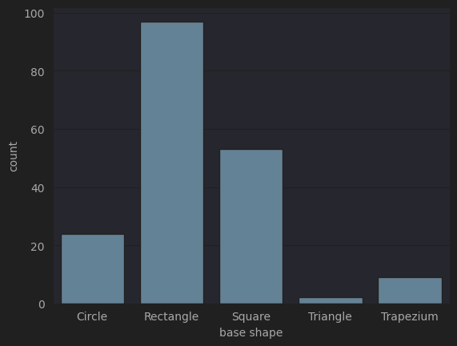

## 1. Dataset Overview (of the clean version)

| Item                              | Description |
|:----------------------------------|:-----------:|
| Dataset name                      |combined_LegoDataset |
| Authors                           |Combined dataset of all groups in the class|
| Number of entries                 |185rows|
| Number of features/variables      |9           |
| Format file (.csv, .txt, etc)     |.xlsx        |

## 2. Dataset Structure (of the clean version) (STEFAN SMID)

| Feature/Variable   | Data type   | Description                                         |   Unique values | Examples                                        |
|:-------------------|:------------|:----------------------------------------------------|----------------:|:------------------------------------------------|
| base dimensions    | object      | Dimensions of the piece in studs (e.g., 2x4, 1x2)   |              12 | 2x2, 2x2, 2x2, 1x2, 1x2                         |
| base shape         | object      | Shape of the base (e.g., Rectangle, Square, Circle) |               5 | Rectangle, Circle, Square, Rectangle, Rectangle |
| color              | object      | Name of the Lego color                              |              62 | grey, orange, black, brickred, green            |
| has slope?         | object      | Indicates if the piece has a slope (Yes/No)         |               2 | No, No, No, No, No                              |
| is duplo?          | object      | Indicates whether the piece is Duplo or not         |               2 | No, No, No, No, No                              |
| number of studs    | float64     | Total number of studs on the top surface            |              10 | 4.0, 12.0, 2.0, 2.0, 2.0                        |
| size type          | object      | Type of Lego piece (e.g., Brick, Plate)             |               2 | Brick, Plate, Plate, Brick, Brick               |
| slope degree       | float64     | Angle of the slope in degrees (0 if none)           |               4 | 0.0, 0.0, 0.0, 0.0, 0.0                         |
| in stock           | int64       | Availability of the part in stock                   |               3 | 1, 1, 3, 1, 1                                   |

## 3. Descriptive statistics (of the clean version)

### Numeric Columns
|       |   number of studs |   slope degree |   in stock |
|:------|------------------:|---------------:|-----------:|
| count |            185    |         185    |     185    |
| mean  |              4.75 |           5.59 |       1.1  |
| std   |              5.11 |          14.72 |       0.37 |
| min   |              0    |           0    |       1    |
| 25%   |              2    |           0    |       1    |
| 50%   |              4    |           0    |       1    |
| 75%   |              6    |           0    |       1    |
| max   |             24    |          45    |       3    |

### Categorical / Object Columns

|                                  | base dimensions   | base shape   | color     | has slope?   | is duplo?   | size type   |
|:---------------------------------|:------------------|:-------------|:----------|:-------------|:------------|:------------|
| Count                            | 185               | 185          | 185       | 185          | 185         | 185         |
| Number of unique values          | 12                | 5            | 62        | 2            | 2           | 2           |
| Most frequent value              | 2x2               | Rectangle    | white     | No           | No          | Plate       |
| Most frequent value (frequency)  | 41                | 97           | 12        | 161          | 160         | 103         |
| Least frequent value             | 4x4               | Triangle     | limegreen | Yes          | Yes         | Brick       |
| Least frequent value (frequency) | 3                 | 2            | 1         | 24           | 25          | 82          |

## 3. _Exploratory plots (optional)_

(1) Countplot of different base shapes:

(2) Wordcloud of different colors by their respective count:

## 4. Data cleaning procedure
### 4.1 Major data inconsistencies:

Column labeling was generally consistent, except for one unnecessary column, Transparent, which was used by only one of the five groups. To maintain consistency, this column was removed.

Data types varied across groups. For example, yes/no responses were recorded inconsistently as 1/0/True/False, and the slope degree column was sometimes left blank instead of using 0. Additionally, the base dimensions column contained interchangeable values, such as 2x4 and 4x2, which represent the same dimension. All such discrepancies were standardized and unified according to the conventions established by our group during data collection.

The most inconsistent category was color, due to the subjective nature of this attribute. Differences included capitalization, extra spaces, and spelling errors. While some colors were very similar (e.g., dark blue vs. navy blue), only basic cleaning was performed, and all original color values were retained to reflect the true inputs from each group.

### 4.2 Minor data inconsistencies _(if some issues cannot be reported in the above table)_
One of the listed shapes, “Wadge” (or “Wedge”), was replaced with “Trapezium” at our discretion, as a wedge represents a 3D shape, while base dimensions should correspond to 2D shapes.

## 5. Recommendations for good practices regarding data collection 
To make data collection easier and more accurate, all groups should agree on one common format for each variable before starting. Having the same structure for things like colors, shapes, and dimensions would keep the data consistent and save a lot of time during cleaning. Using the same color names, for example, would help avoid duplicate entries caused by small spelling or capitalization differences. It would also help to set clear rules for how to enter data, such as always using “X” in base dimensions and using the same yes/no format, so that to make the dataset more reliable and easier to compare.

## 6. AI Disclaimer:
Took help from AI in standardizing the base dimension column to get the desired output.
