## 0. Authors of the report

| Name      |               Contribution                                    |
|:----------|:------------------------------------------------------------- |
|Assad      | Data Loading & Merging, Cleaning, Analysis Q1-10, Reporting   |
|Sumeet     | Data Cleaning, Analysis Q1-10, Reporting                      |
|Stefan     | Data Cleaning, Analysis Q13-14, Reporting                     |
|Shiva      | Data Loading & Merging, Analysis Q11-12                       |
|Zeyad      | Data Loading & Merging, Data Inspection                       |

## 1. Dataset Overview (of the clean version)

| Item                                                   |                                                           Description                                                            |
|:-------------------------------------------------------|:--------------------------------------------------------------------------------------------------------------------------------|
| Dataset name                                           |                                                Airbnb Europe _(adapted dataset)_                                                 |
| Number of rows                                         |                                             51707 _(adapted dataset after cleaning)_                                             |
| Number of columns                                      |                                              21 _(adapted dataset after cleaning)_                                               |
| Format file (.csv, .txt, etc)                          |                                             .csv _(adapted dataset after cleaning)_                                              |
| Authors of the dataset                                 |                                        Kristóf Gyódi, Łukasz Nawaro _(original datasets)_                                        |
| Source (name)                                          | Determinants of Airbnb prices in European cities: A spatial econometrics approach (Supplementary Material) _(original datasets)_ |
| Source (link)                                          |     https://docs.google.com/spreadsheets/d/1ecopK6oyyb4d_7-QLrCr8YlgFrCetHU7-VQfnYej7JY/edit?usp=sharing _(adapted dataset)_     |

## 2. Dataset Structure

| Feature/Variable           | Data type   | Description                                         |   Number of Unique values | Example values                                          |
|:---------------------------|:------------|:----------------------------------------------------|--------------------------:|:--------------------------------------------------------|
| sheet_name                 | object      | Name of the Excel sheet                             |                        20 | amsterdam_weekdays, amsterdam_weekends, athens_weekdays |
| country                    | object      | Country where the listing is located                |                        10 | Netherlands, Greece, Germany                            |
| city                       | object      | City where the listing is located                   |                        10 | Amsterdam, Athens, Berlin                               |
| day_type                   | object      | Type of day                                         |                         2 | Weekdays, Weekends                                      |
| price                      | float64     | Price per night                                     |                      9876 | 194.03, 344.25, 264.1                                   |
| room_type                  | object      | Type of room offered                                |                         3 | Private room, Entire home/apt, Shared room              |
| room_category              | object      | Category of room                                    |                         3 | Private, Other, Shared                                  |
| person_capacity            | int64       | Maximum number of guests                            |                         5 | 2, 4, 3                                                 |
| host_is_superhost          | bool        | Hosts with the superhost status                     |                         2 | False, True                                             |
| listings_by_host           | object      | Number of listings offered by this host             |                         3 | 2-4, 1, 4+                                              |
| cleanliness_rating         | int64       | Guest reviews: scale to 10                          |                         9 | 10, 8, 9                                                |
| guest_satisfaction_overall | int64       | Guest reviews: scale to 100                         |                        53 | 93, 85, 87                                              |
| bedrooms                   | int64       | Number of bedrooms                                  |                        10 | 1, 2, 3                                                 |
| citycenter_dist            | float64     | Distance to the city centre in kilometres           |                      1320 | 5.02, 0.49, 5.75                                        |
| metro_dist                 | float64     | Distance to the closest metro station in kilometres |                       652 | 2.54, 0.24, 3.65                                        |
| attr_index                 | float64     | Attraction index: scale to 100                      |                     25939 | 78.69, 631.18, 75.28                                    |
| attr_index_norm            | float64     | Normalized attraction index (0–1 scale)             |                      4277 | 4.17, 33.42, 3.99                                       |
| rest_index                 | float64     | Restaurant index: scale to 100                      |                     32606 | 98.25, 837.28, 95.39                                    |
| rest_index_norm            | float64     | Normalized restaurant index (0-1 scale)             |                      7127 | 6.85, 58.34, 6.65                                       |
| lng                        | float64     | Longitude coordinate of the listing                 |                       256 | 4.91, 4.9, 4.98                                         |
| lat                        | float64     | Latitude coordinate of the listing                  |                       147 | 52.42, 52.37, 52.36                                     |

## 3. Data cleaning 

Our data cleaning activity involved the following:
1. Removing the first column that contained the index for listings.
2. Renaming of column from 'realSum' to 'Price' which was more intuitive.
3. Renaming of column from 'dist' to 'citycenter_dist' to make it more specific. 
4. "room_shared", "room_private", "multi", "biz" columns containing dummy variables were deleted and replaced with "room_category" and "listing by host" columns respectively. This helped condense redundant information in fewer columns.
5. Some new columns such as "sheet_name", "city", "country" and "day_type" were added as relevant features to the data.
6. All column names were eventually standardized to lowercase and spaces were replaced with underscores.
7. Column positions were adjusted to improve flow of data.
8. Duplicate Rows were checked but none were found!

## 4. Descriptive statistics

### Numeric Columns

|  | price | person\_capacity | cleanliness\_rating | guest\_satisfaction\_overall | bedrooms | citycenter\_dist | metro\_dist | attr\_index | attr\_index\_norm | rest\_index | rest\_index\_norm | lng | lat |
| :--- | :--- | :--- | :--- | :--- | :--- | :--- | :--- | :--- | :--- | :--- | :--- | :--- | :--- |
| count | 51707 | 51707 | 51707 | 51707 | 51707 | 51707 | 51707 | 51707 | 51707 | 51707 | 51707 | 51707 | 51707 |
| mean | 279.88 | 3.16 | 9.39 | 92.63 | 1.16 | 3.19 | 0.68 | 294.2 | 13.42 | 626.86 | 22.79 | 7.43 | 45.67 |
| std | 327.95 | 1.3 | 0.95 | 8.95 | 0.63 | 2.39 | 0.86 | 224.75 | 9.81 | 497.92 | 17.8 | 9.8 | 5.25 |
| min | 34.78 | 2.0 | 2.0 | 20.0 | 0.0 | 0.02 | 0.0 | 15.15 | 0.93 | 19.58 | 0.59 | -9.23 | 37.95 |
| 25% | 148.75 | 2.0 | 9.0 | 90.0 | 1.0 | 1.45 | 0.25 | 136.8 | 6.38 | 250.85 | 8.75 | -0.07 | 41.4 |
| 50% | 211.34 | 3.0 | 10.0 | 95.0 | 1.0 | 2.61 | 0.41 | 234.33 | 11.47 | 522.05 | 17.54 | 4.87 | 47.51 |
| 75% | 319.69 | 4.0 | 10.0 | 99.0 | 1.0 | 4.26 | 0.74 | 385.76 | 17.42 | 832.63 | 32.96 | 13.52 | 51.47 |
| max | 18545.45 | 6.0 | 10.0 | 100.0 | 10.0 | 25.28 | 14.27 | 4513.56 | 100.0 | 6696.16 | 100.0 | 23.79 | 52.64 |

### Categorical / Object Columns

|  | sheet\_name | country | city | day\_type | room\_type | room\_category | listings\_by\_host |
| :--- | :--- | :--- | :--- | :--- | :--- | :--- | :--- |
| Count | 51707 | 51707 | 51707 | 51707 | 51707 | 51707 | 51707 |
| Number of unique values | 20 | 10 | 10 | 2 | 3 | 3 | 3 |
| Most frequent value | london\_weekends | United Kingdom | London | Weekends | Entire home/apt | Other | 1 |
| Most frequent value \(frequency\) | 5379 | 9993 | 9993 | 26207 | 32648 | 32648 | 18534 |
| Least frequent value | amsterdam\_weekends | Netherlands | Amsterdam | Weekdays | Shared room | Shared | 2-4 |
| Least frequent value \(frequency\) | 977 | 2080 | 2080 | 25500 | 366 | 366 | 15065 |

## 5. Analysis - Research question

**1. How many listings are in each city in total and also per type of day?**

a.
| city      |   Total listings per city |
|:----------|--------------------------:|
| Amsterdam |                      2080 |
| Athens    |                      5280 |
| Barcelona |                      2833 |
| Berlin    |                      2484 |
| Budapest  |                      4022 |
| Lisbon    |                      5763 |
| London    |                      9993 |
| Paris     |                      6688 |
| Rome      |                      9027 |
| Vienna    |                      3537 |

b. 
| city      | day_type   |   Total listings per city and day type |
|:----------|:-----------|---------------------------------------:|
| Amsterdam | Weekdays   |                                   1103 |
| Amsterdam | Weekends   |                                    977 |
| Athens    | Weekdays   |                                   2653 |
| Athens    | Weekends   |                                   2627 |
| Barcelona | Weekdays   |                                   1555 |
| Barcelona | Weekends   |                                   1278 |
| Berlin    | Weekdays   |                                   1284 |
| Berlin    | Weekends   |                                   1200 |
| Budapest  | Weekdays   |                                   2074 |
| Budapest  | Weekends   |                                   1948 |
| Lisbon    | Weekdays   |                                   2857 |
| Lisbon    | Weekends   |                                   2906 |
| London    | Weekdays   |                                   4614 |
| London    | Weekends   |                                   5379 |
| Paris     | Weekdays   |                                   3130 |
| Paris     | Weekends   |                                   3558 |
| Rome      | Weekdays   |                                   4492 |
| Rome      | Weekends   |                                   4535 |
| Vienna    | Weekdays   |                                   1738 |
| Vienna    | Weekends   |                                   1799 |

**2. Which city has the biggest proportion of superhosts?** 

The city which has the biggest proportion of superhosts is: **Rome**

| city      |   Superhosts_per_city |
|:----------|----------------------:|
| Rome      |                  2949 |
| Athens    |                  2263 |
| London    |                  1573 |
| Budapest  |                  1524 |
| Lisbon    |                  1233 |
| Vienna    |                  1005 |
| Paris     |                   941 |
| Berlin    |                   639 |
| Amsterdam |                   591 |
| Barcelona |                   514 |

**3. Which cities have listings with more than four rooms?** 

Cities with listings having 4 or more bedrooms: Amsterdam, Athens, Berlin, Barcelona, Lisbon, London, Paris, Rome, Vienna

| city      |   Listings_4plus_bedrooms |
|:----------|--------------------------:|
| Amsterdam |                        20 |
| Athens    |                         2 |
| Barcelona |                         4 |
| Berlin    |                         5 |
| Lisbon    |                        25 |
| London    |                        36 |
| Paris     |                         7 |
| Rome      |                        16 |
| Vienna    |                         7 |

**4. Which city has the most entire home/apt type listings?**

The city with the most entire home/apt listings is: **Rome**

| city      |   Entire_home_count |
|:----------|--------------------:|
| Rome      |                5561 |
| Paris     |                5067 |
| Athens    |                4872 |
| London    |                4384 |
| Lisbon    |                3878 |
| Budapest  |                3589 |
| Vienna    |                2747 |
| Amsterdam |                1126 |
| Berlin    |                 882 |
| Barcelona |                 542 |

**5. Are ratings typically high across listings, or is there a wide variation?** 

&ensp; **a. Plot the distribution of guest_satisfaction_overall ratings.**

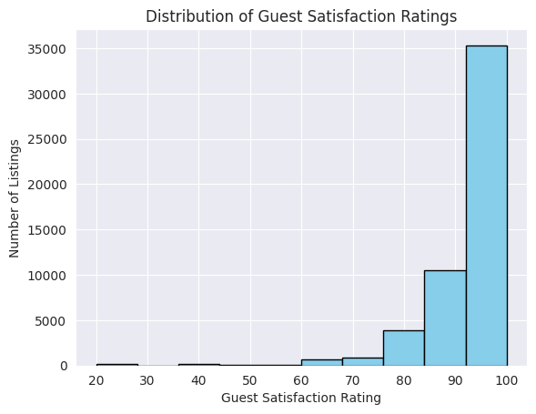

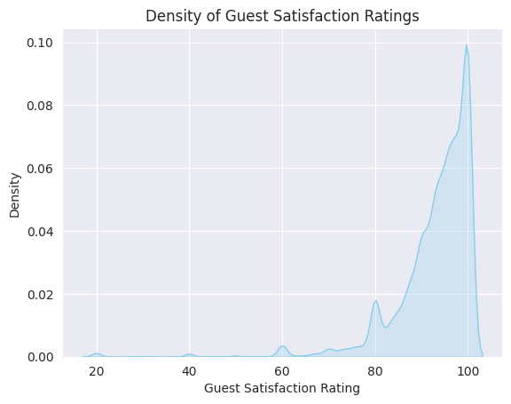

**Analysis:** 

Most Airbnb listings have high guest satisfaction ratings, with the bulk of listings 
clustered between 90 and 100. The distribution is skewed toward the top, with very few low-rated listings. 
This shows that guests are generally very satisfied across listings.

&ensp; **b. Examine the distribution of cleanliness_rating.** 

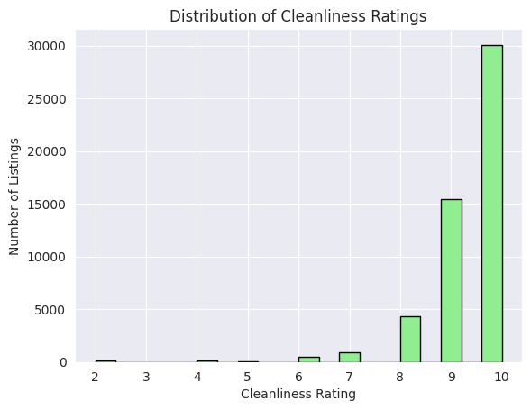
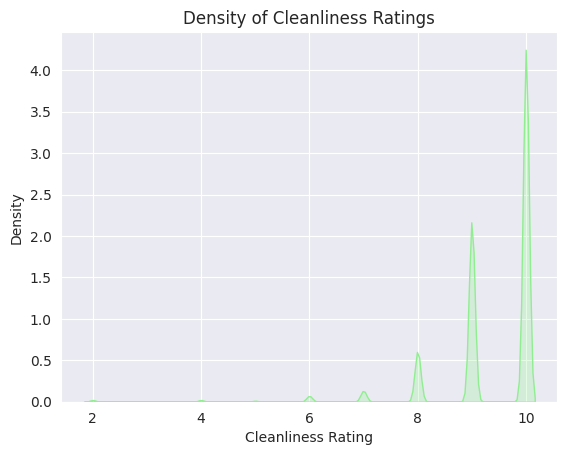

**Analysis:** 

The cleanliness ratings are extremely high and consistent across listings. 
    Most listings score 9 or 10, showing that hosts maintain a very high standard of cleanliness. 
    Also, there is no major variation, indicating that cleanliness is uniformly excellent across 
    the dataset. 

**6. How does person_capacity vary across listings? What is the most common capacity of listings?**

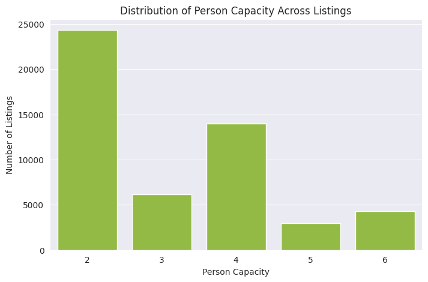

**Analysis:** 

The majority of AirBnb listings in the dataset are designed for 2 to 4 guests, with 2-person listings
being the most common. Listings for larger groups of 5 or 6 people are relatively rare. This suggests 
that the market is skewed toward small to medium-sized groups, likely reflecting typical traveler demand.

**7. Plot the distribution of price (former realSum) for both weekday and weekend offers**

&ensp; **a. check normality, skewness, modality** 

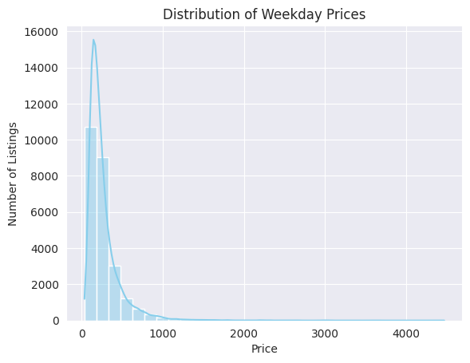
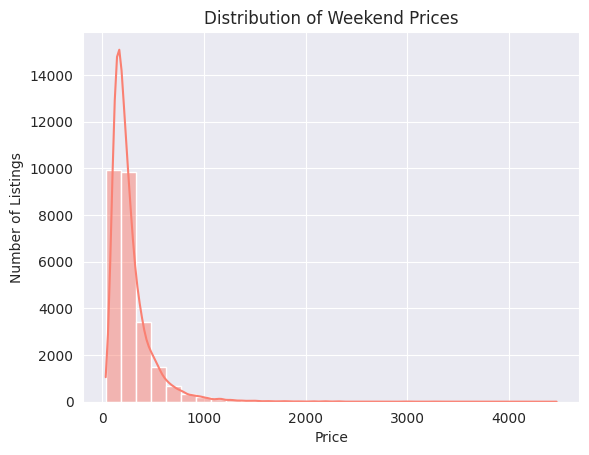

**Analysis:** 

The distribution of Airbnb prices for both weekdays and weekends is highly right-skewed, 
with skewness values of 24.1 for weekdays and 16.6 for weekends. Both distributions have 
extremely high kurtosis (939 for weekdays, 566 for weekends), indicating heavy tails and 
the presence of extreme outliers. The histograms show a unimodal distribution, with a single 
peak at lower price ranges. The Shapiro-Wilk test on a sample of 5,000 listings confirms that 
the price distributions are not normal (p-values << 0.05). Overall, most listings are clustered
at lower prices, but a few extremely high-priced listings create a long right tail.

&ensp; **b. If skewed, consider using transformations (e.g. log); can you normalize it?**

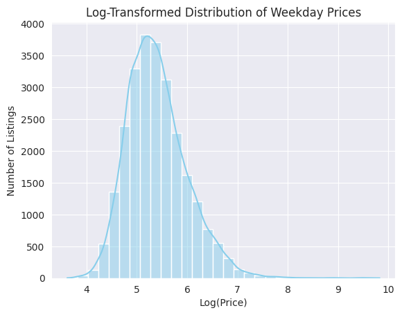
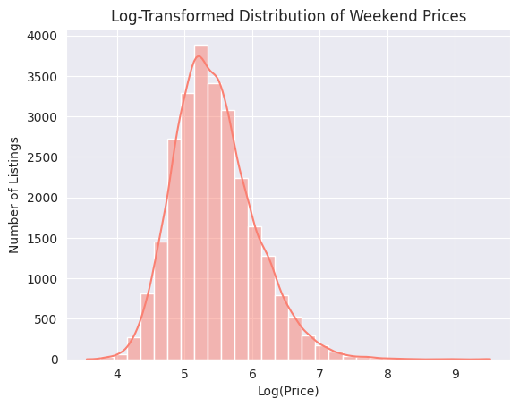

**Analysis:** 

The log-transformed distribution of Airbnb prices for both weekdays and weekends 
is much closer to a symmetric shape, with skewness reduced to around 0.76 for weekdays and 0.66 for 
weekends, and lower kurtosis values (1.52 for weekdays, 1.10 for weekends). Both distributions 
remain unimodal, with a single peak visible in the histograms. While the Shapiro-Wilk test still 
indicates non-normality (p-values << 0.05), the log transformation effectively reduces the influence 
of extreme high-priced listings.

**8. Is there a difference in price per night between two cities? Choose at least three pairs of cities during weekdays.**

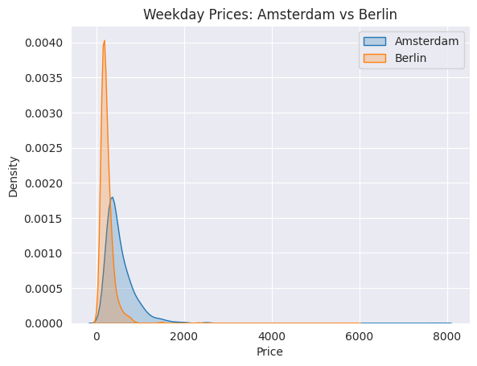
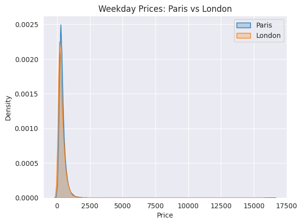
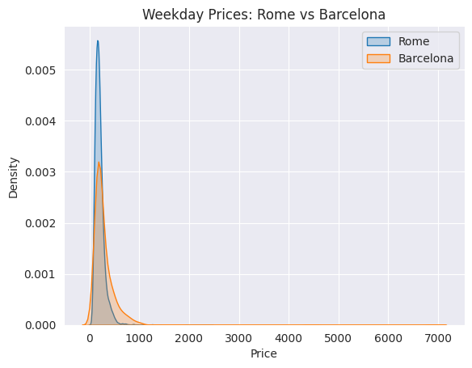

**Analysis:** 

The t-test results indicate that there are statistically significant differences in weekday 
prices between all three pairs of cities (Amsterdam vs Berlin, Paris vs London, Rome vs Barcelona), 
with p-values effectively 0. This suggests that the average nightly price differs between these cities.

**9. Does the price per night tend to be higher on weekends?**

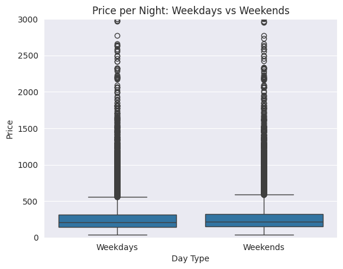

**Analysis:** 

As per analysis, the average price per night is certainly higher on weekends compared to
weekdays, indicating that Airbnb hosts probably charge a premium during weekends, likely due to higher demand. 
The boxplot shows that weekday prices have more variation and outliers, meaning there are more very low
and very high prices on weekdays. Weekend prices, while higher on average, are more consistently clustered.

**10. Are listings of superhosts more expensive than those of normal hosts?** 

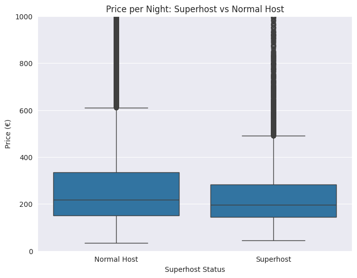

**Analysis:** 

The average superhosts listing price is 254.45 €, while normal host 
listings average 288.63 €. This indicates that, on average, Normal Host listings 
are slightly more expensive than Superhost listings. Superhosts do not charge systematically 
higher prices, though Normal Hosts exhibit more extreme high-price outliers.

**11. Are superhosts closer to the city center and metro station than normal hosts?** 

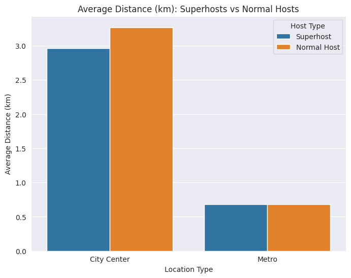

**Analysis:** 

The results show that Superhosts are usually closer to the city center and metro stations than Normal Hosts. This means Superhosts often have listings in better and more convenient locations. Being close to transport and main attractions likely makes it easier for guests to travel and enjoy their stay, which can lead to better reviews and help hosts become or stay Superhosts.

**12. Are superhosts cleaner than normal hosts?** 

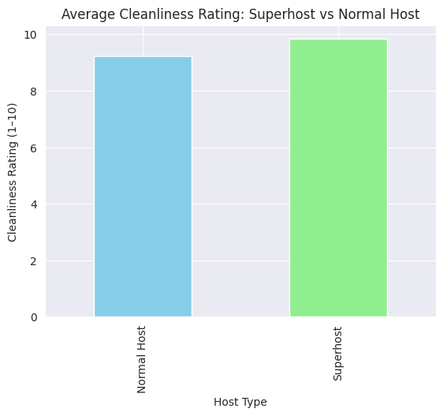

**Analysis:** 

The results show that Superhosts have a higher average cleanliness rating (9.83) compared to Normal Hosts (9.24). This means that Superhosts generally maintain cleaner and better kept properties. Cleanliness is an important factor for guest satisfaction and maintaining high cleanliness standards likely helps hosts earn and keep their Superhost status.

**13. Is there a pattern between room types and superhost status?** 

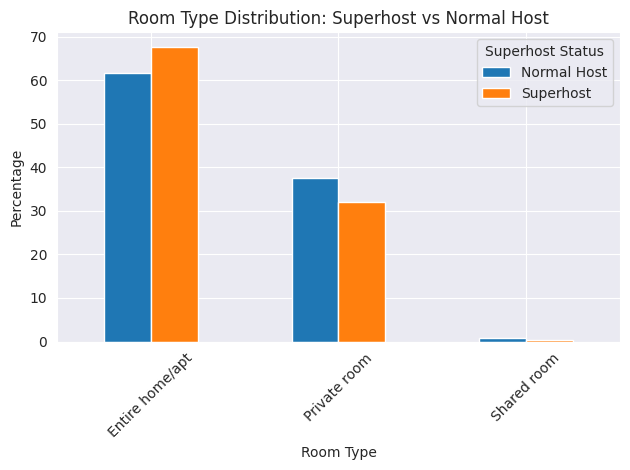

**Analysis:** 

There appears to be a pattern between room types and superhost status:
1. Entire homes/apartments have a higher representation among superhosts
2. Private rooms show similar proportions between superhosts and normal hosts, with, relatively speaking, slightly more normal hosts
3. Shared rooms are less common among superhosts
This suggests that superhosts are more likely to rent out entire properties rather than shared spaces.

**14. Is renting an entire home/apt more expensive than a private room? Does that depend on the city?**

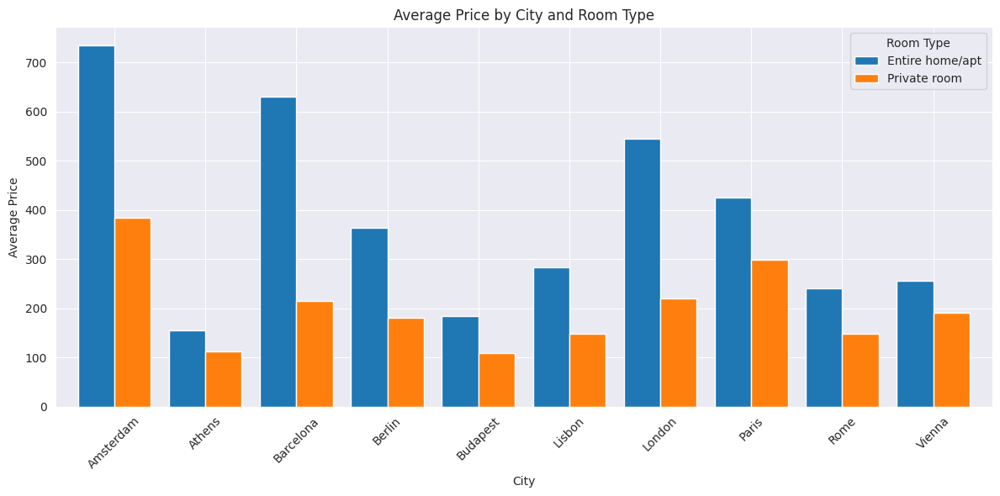

**Analysis:**

1. Entire homes/apartments are consistently more expensive than private rooms across all cities
2. The price premium varies significantly by city
3. Some cities show a larger gap between room types than others
4. London and Paris show the highest absolute price differences
