## 0. Authors of the report

| Name      | Contribution                         |
|:----------|:-------------------------------------|
|Assad      | Data Cleaning, Final Report Creation |
|Sumeet     | "Economic Performance"                |
|Stefan     | "Governance", Final Report Creation    |
|Shiva      | "Human Wellbeing"                      |
|Zeyad      | "Environment"                          |

## 1. Dataset Overview (of the clean version)

| Item                                                   | Description                                                                                                                       |
|:-------------------------------------------------------|:----------------------------------------------------------------------------------------------------------------------------------|
| Dataset name                                           | World Bank Data                                                                                                                   |
| Number of rows                                         | 13,056                                                                                                                           |
| Number of columns                                      | 23                                                                                                                               |
| Format file (.csv, .txt, etc)                          | .csv and .xlsx                                                                                                                   |
| Authors of the dataset                                 | World Bank                                                                                                                       |
| Source (name)                                          | Github                                                                                                                           |
| Source (link)                                          | [Link](https://github.com/datagus/ASDA2025/tree/f3dd85c98b99a36084a16b479b025cb11937bdab/datasets/homework_week5)                |
| Date of download/analysis                              | 14/11/2025                                                                                                                       |

## 2. Dataset Structure

| Feature/variable                  | Data type   | Description                             |   # Unique values | Eg. values                           |
|:----------------------------------|:------------|:----------------------------------------|------------------:|:-------------------------------------|
| country                           | object      | Country                                 |               204 | ['Angola', 'Finland']                |
| code                              | object      | Country code                            |               204 | ['COG', 'NER']                       |
| region                            | object      | Geographic region                       |                 7 | ['South Asia', 'Sub-Saharan Africa'] |
| income_group                      | object      | Income classification                   |                 4 | ['Low income', 'High income']        |
| lending_category                  | object      | Lending group class                     |                 4 | ['IDA', 'Blend']                     |
| year                              | int32       | Year of measurement                     |                64 | [1993, 2022]                         |
| agricultural_land_pct             | float64     | Agri land % of total area               |              4922 | ['57.83', '80.77']                   |
| forest_land_pct                   | float64     | Forest % of total area                  |              3705 | ['30.75', '94.40']                   |
| control_of_corruption_estimate    | float64     | Estimate of corruption control          |               427 | ['0.14', '1.67']                     |
| access_to_electricity_pct         | float64     | Population with electricity access      |              2353 | ['97.33', '98.36']                   |
| renewable_energy_consumption_pct  | float64     | Renewable energy % of total consumption |              3986 | ['59.51', '10.97']                   |
| co2_emissions                     | float64     | CO2 emissions in kt                     |              5784 | ['360.70', '652.53']                 |
| pop_density                       | float64     | Population per km²                      |              8678 | ['285.78', '38.18']                  |
| inflation_yr_pct                  | float64     | Annual inflation rate                   |              2748 | ['9.27', '3.69']                     |
| tax_revenue_pct                   | float64     | Tax revenue % of GDP                    |              2086 | ['6.43', '5.20']                     |
| gov_effectiveness_estimate        | float64     | Estimate of government effectiveness    |               457 | ['2.23', '1.02']                     |
| gdp_current_usd_M                 | float64     | GDP in current USD (M)                  |             10138 | ['2,780.42', '3,284.27']             |
| political_stability_estimate      | float64     | Estimate of political stability         |               465 | ['-1.38', '0.57']                    |
| rule_of_law_estimate              | float64     | Estimate of rule of law                 |               430 | ['-1.12', '0.55']                    |
| gov_exp_on_education_pct          | float64     | Gov. education expenditure % of GDP     |               824 | ['0.83', '2.08']                     |
| gov_health_exp_pct                | float64     | Gov. health expenditure % of GDP        |               875 | ['10.21', '4.00']                    |
| life_expectancy_at_birth          | float64     | Life expectancy in years                |              4087 | ['65.56', '43.79']                   |
| pop_M                             | float64     | Population (M)                          |              4059 | ['19.08', '14.11']                   |
| voice_and_accountability_estimate | float64     | Estimate of voice and accountability    |               405 | ['0.53', '-0.07']                    |

## 3. Data cleaning 

| Issue                     | Names of Columns affected                                    | Description of the Issue                                                                 | Action Taken                                                                                       |
|----------------------------|--------------------------------------------------------------|------------------------------------------------------------------------------------------|---------------------------------------------------------------------------------------------------|
| Inconsistent column labeling | All columns                                                 | Column names had inconsistent capitalization, spaces, %, long names, or typos           | Standardized column names: lowercase, underscores, concise, replaced % with _pct   |
| Wrong data types           | `date`, numeric columns                                     | `date` was object; numeric columns had inconsistent precision                             | Extracted Year from `date` in int format; ensured numeric columns are float/int; rounded floats to 2 decimals |
| Missing values             | `region`, `income_group`, `lending_category`, country-specific indicators | Some rows had missing categorical or numeric values                                       | Imputed using most frequent value by region, median by region & income group, or logical assignment. Dropped countries with >8 missing indicators |
| Duplicates                 | All columns                                                 | Checked for fully identical rows                                                          | No duplicates found                                                                               |
| Inconsistent categories    | `income_group`, `lending_category`, `region`, `country`     | Categorical values were missing or inconsistent; country names had accents or special characters | Standardized categories, imputed missing values, corrected spelling; normalized country names (removed accents/special characters) |
| Other                      | `gdp_current_us`                                            | GDP values were very large and hard to read                                              | Converted GDP to millions, rounded to 2 decimals, renamed column to `gdp_current_usd_M`         |

## 4. Descriptive statistics

### Numeric Columns

|       |   gdp_current_usd_M |    co2_emissions |   gov_effectiveness_estimate |   life_expectancy_at_birth |
|:------|--------------------:|-----------------:|-----------------------------:|---------------------------:|
| count |     13056           |  13056           |                     13056    |                   13056    |
| mean  |    166064           | 143573           |                        -0.02 |                      64.63 |
| std   |    934961           | 622493           |                         0.99 |                      11.29 |
| min   |         8.82        |      0           |                        -2.44 |                      12    |
| 25%   |      1534.1         |   1747.98        |                        -0.75 |                      57.45 |
| 50%   |      7745.25        |   9563.14        |                        -0.16 |                      67.54 |
| 75%   |     46537           |  55132.7         |                         0.69 |                      73.06 |
| max   |         2.54397e+07 |      1.09447e+07 |                         2.47 |                      85.5  |

### Categorical / Object Columns

|                                  | country     | region                | income_group   | lending_category   |
|:---------------------------------|:------------|:----------------------|:---------------|:-------------------|
| Count                            | 13056       | 13056                 | 13056          | 13056              |
| Number of unique values          | 204         | 7                     | 4              | 4                  |
| Most frequent value              | Afghanistan | Europe & Central Asia | High income    | IBRD               |
| Most frequent value (frequency)  | 64          | 3392                  | 4736           | 4416               |
| Least frequent value             | Afghanistan | North America         | Low income     | Blend              |
| Least frequent value (frequency) | 64          | 192                   | 1664           | 1216               |

### Basic Inspection Plots (Categorical)

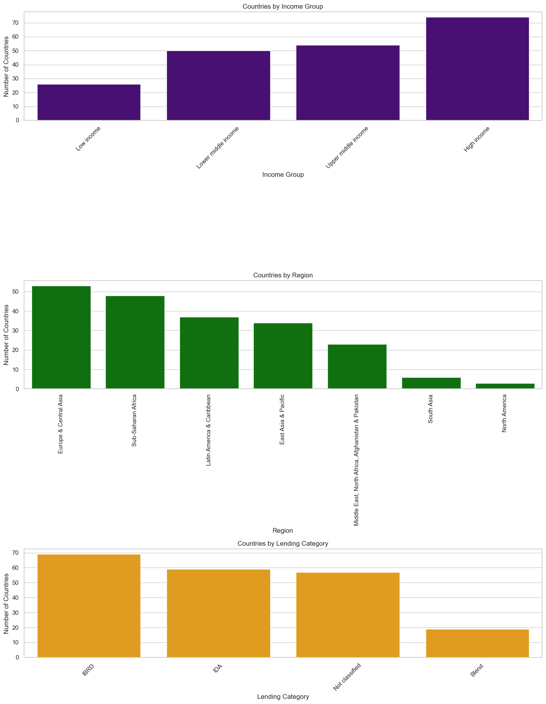

### Basic Inspection Plots (Numeric)

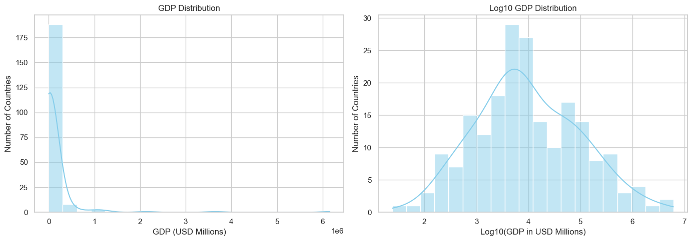
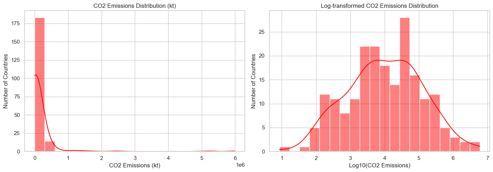
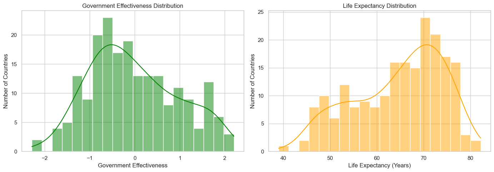

## 5. Analysis - Research question
### Governance and institutional quality indicators:

    goverment_effectiveness_estimate
    control_of_corruption_estimate
    rule_of_law_estimate
    voice_and_accountability_estimate
    political_stability_estimate

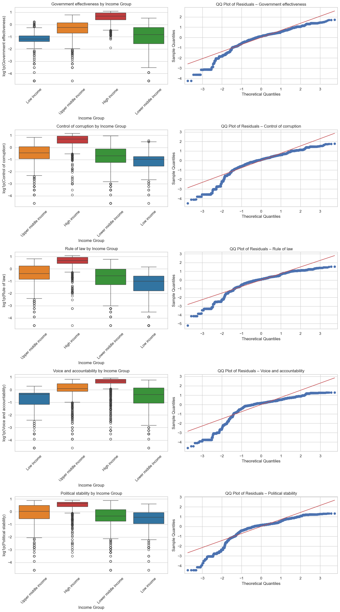

#### Governance Story:

The analysis shows that none of the indicators is normally-distributed. Although this hinders the statistical tests applied and their explanation power, it can clearly be seen in the results and the respective boxplots, that there is always the trend in the data that higher income correlates with higher means in political stability, governance effectiveness, rule of law, voice&accountability and corruption control. Interestingly, the standard deviance and, hence, also the variance is lowest in high income countries for each indicator applied.

### Environmental sustainability indicators:

    CO2_emisions
    renewvable_energy_consumption%
    forest_land%
    agricultural_land

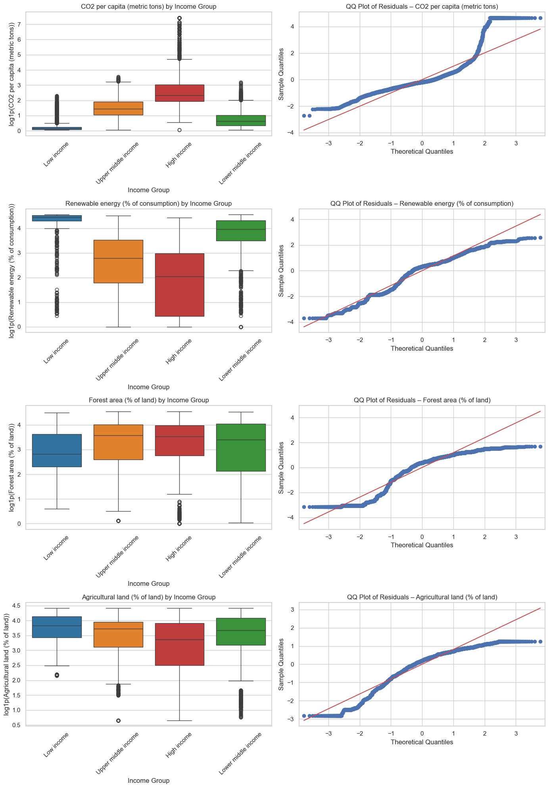

#### Environmental Story

High-income countries sit at one end of the global environmental spectrum. Their economies are built on decades of industrialization, technological advancement, and energy-intensive lifestyles. With this prosperity comes a cost: these nations emit far more CO₂ per capita than any other group. Their consumption patterns, transportation systems, and reliance on fossil fuels drive emissions upward. At the same time, they maintain relatively stable shares of forest and agricultural land, protected in many cases by strong regulations and well-funded environmental institutions.

Low-income countries tell a very different story. Their CO₂ emissions are the lowest in the world, not because of cleaner systems, but because industrial activity remains limited and energy use is modest. Instead, their lives and economies are closely tied to the land. High levels of agricultural land reflect dependence on subsistence farming and natural resources for livelihoods. Renewable energy use is also relatively high, often because traditional biomass and non-modern energy sources remain common.

Middle-income nations (both lower-middle and upper-middle) write the chapter of transition. They sit between two worlds: expanding industrial sectors increase emissions, yet renewable energy adoption is still developing. Their land use patterns sit between low- and high-income groups, reflecting gradual shifts from agriculture-dependent economies toward diversified, industrialized ones. These countries face the complex task of growing their economies while attempting to avoid the high-emission path taken historically by wealthy nations.

Together, these narratives form a global picture of environmental sustainability shaped deeply by income. Wealthier nations grapple with the consequences of growth, poorer nations rely heavily on land and natural resources, and middle-income nations navigate the turbulence of development. This story makes one message clear: sustainability is not a one-size-fits-all challenge. Each income group carries its own responsibilities — and its own opportunities — in steering the planet toward a more sustainable future.

### Economic performance and poverty reduction indicators

    GDP_current_US
    inflation_annual%
    tax_revenue%

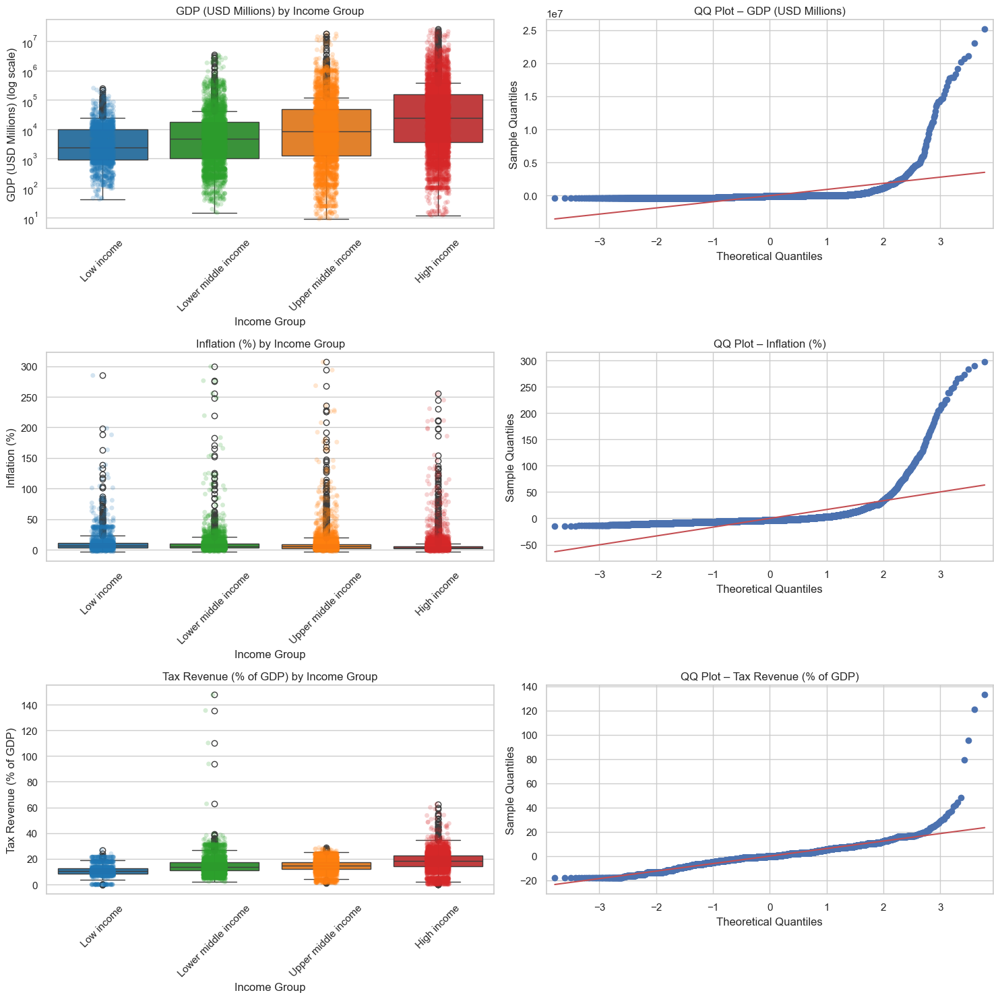

#### Economic Story

Economic performance and fiscal capacity clearly vary across income groups. High-income countries benefit from high GDP, stable inflation, and effective taxation systems, while low-income countries face challenges in all three indicators. Middle-income countries are in transition, balancing growth and stability. These patterns underscore the importance of income-specific policies to reduce poverty, stabilize prices, and strengthen public finances.

### Human well-being and health indicators:

    life_expectancy_at_birth
    government_expenditure_on_education%
    government_health_expenditure%
    access_to_electricity%
    population_density

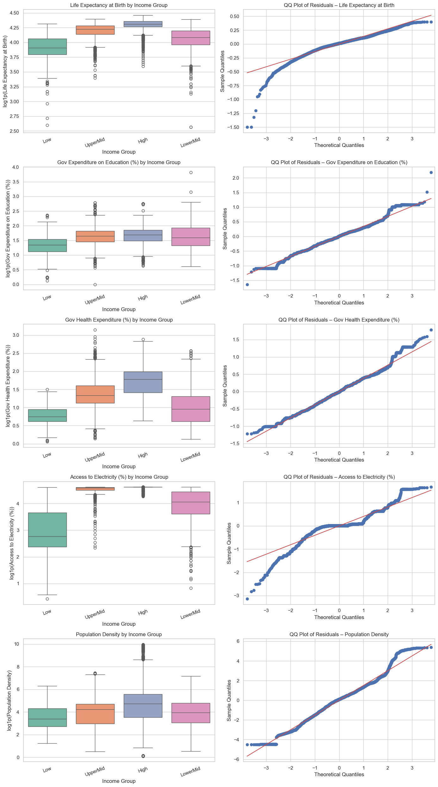

#### Human Well-being Story

Across all five human well-being indicators, higher-income countries clearly perform better than the rest. They have the highest life expectancy, strong government spending on education and health, and almost universal access to electricity. Low-income countries face the biggest challenges, with much lower life expectancy and limited investment in social services. Middle-income countries fall in between: some are improving quickly, while others still resemble low-income levels. Population density does not follow an income pattern because it depends more on geography and urbanization than on income. Overall, the results show that income plays a major role in shaping people’s living conditions, but each group faces different development priorities. The gap between low- and high-income countries highlights the need for more investment in health, education, and basic infrastructure in poorer nations.

## Overall Analysis

Experimented with some other trends from the data:

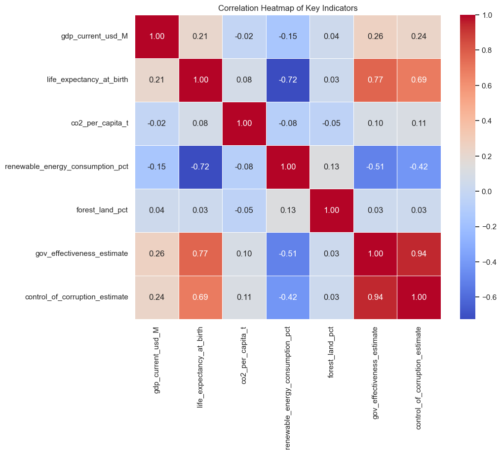
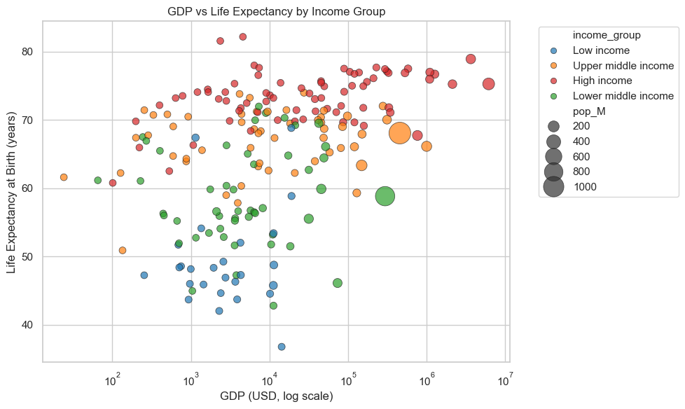
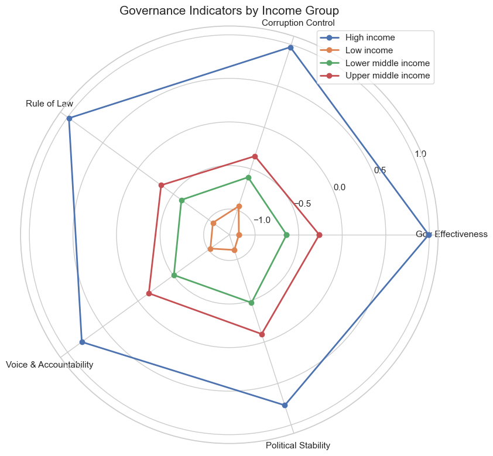

After analyzing all themes, the data reveal a clear and consistent pattern across governance, environmental, economic, and human well-being indicators: higher-income countries consistently outperform lower-income countries, benefiting from stronger institutions, higher life expectancy, better social services, and advanced industrialized economies. Low-income nations, while emitting less CO₂ and relying heavily on land and natural resources, face structural challenges in governance, economic stability, and human development. Middle-income countries occupy a transitional space, balancing industrial growth, environmental pressures, and gradual improvements in well-being. Overall, income is a key determinant shaping national outcomes, with each group presenting distinct challenges and opportunities, highlighting the need for tailored policies to promote sustainable development and equitable living standards globally.