# World Bank Report Analysis

| Name      | Contribution                         |
|:----------|:-------------------------------------|
|Assad      | Corruption vs Gov Effectiveness |
|Zeyad     | Political Stability vs Inflation                |
|Shiva     | Life expectancy vs GDP    |
|Stefan      |CO2 vs Renewable Energies                 |
|Sumeet     |            Government effectiveness Vs Government expenditure on education               |

  
<b>Background</b>

 

This project uses World Bank indicators across governance, environmental sustainability, economic performance, and human well-being to understand how countries develop around the world. One important observation is that the data for most indicators is **not normally distributed**, which affects statistical testing but does not hide the overall trends.

Across all themes, a consistent trend appears: **A country's income level makes a big difference**. Wealthier nations generally have stronger institutions, better social services, and more stable economies. Poorer countries face bigger challenges but often rely more on agriculture and renewable resources. Middle-income countries are somewhere in between, balancing growth, development, and environmental pressures.

A brief summary of analysis as follows:

| **Theme** | **Indicators Selected** | **Key Patterns Observed** | **Overall Analysis** |
|----------|--------------------------|----------------------------|-----------------------------|
| **Governance** | Government effectiveness, control of corruption, rule of law, voice & accountability, political stability | None of the indicators are normally distributed; higher-income countries consistently score higher; variance is lowest in high-income countries. | Governance strength and institutional quality rise with income levels. |
| **Environment** | CO₂ emissions, renewable energy consumption %, forest land %, agricultural land % | High-income countries emit the most CO₂ but maintain stable forests; low-income countries rely heavily on agriculture and renewables; middle-income countries are transitioning. | Environmental outcomes reflect stages of development and industrialization. |
| **Economic Performance** | GDP, inflation %, tax revenue % | High-income = strong GDP and stable inflation; low-income = weak tax capacity and high inflation; middle-income = transitioning. | Higher income is linked with economic stability and stronger fiscal systems. |
| **Human Well-Being** | Life expectancy, education spending %, health spending %, access to electricity %, population density | High-income countries lead in health, education spending, and electrification; low-income countries show large gaps; population density varies independently of income. | Human well-being improves with income, except density which depends on geography. |

---

_A further analysis is done by the group to independently study the correlation between various indicators from the data set and draw individual inferences._

  
<b>Control of Corruption vs Government Effectiveness</b>

 

**How does control of corruption relate to government effectiveness across countries from 2000 to 2024, and does this relationship vary across income groups?**

The data consist of two governance indicators: **control_of_corruption_estimate** and **gov_effectiveness_estimate**. Inspection of the distributions shows that neither variable follows a normal distribution, even after attempts at log transformation. Some countries exhibit extreme values due to political crises or exceptionally stable governance systems. Given the non-normality between the two indicators, the Spearman correlation is chosen as the most appropriate statistical test for this analysis.

A scatter plot grouped by income level shows a clear positive trend, with high-income countries clustering at high values for both indicators, middle-income countries showing moderate values, and low-income countries appearing at lower levels. The spearman correlation is strongest for high-income countries **(0.9)** and weakest for lower-middle income countries **(0.7)**

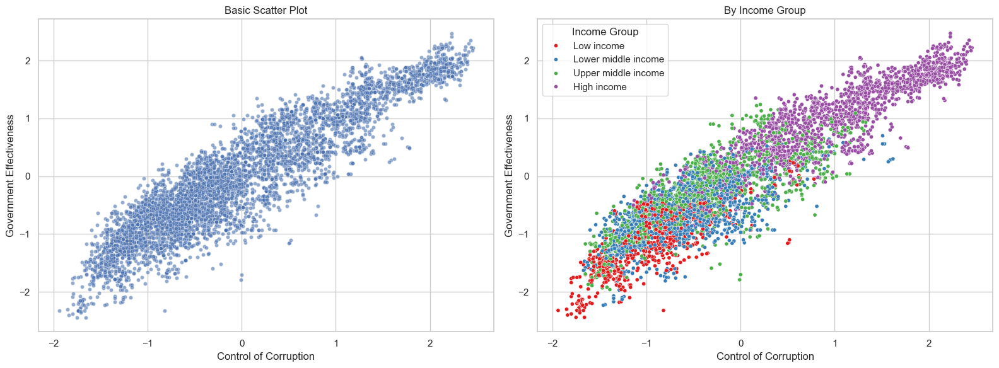

The Spearman correlation for the overall dataset is **0.918** with a p-value < 1e-10, indicating a very strong and statistically significant positive relationship between control of corruption and government effectiveness.

As expected, a temporal analysis showed similar trends pre and post 2008 as can be seen below:

Additional analysis for selected countries highlight the two extreme dynamics: 

1. **Yemen** is a country that has had political instability, civil war, and governance challenges over the past 20+ years. Because of this instability, both corruption control and government effectiveness fluctuate together (mostly both deteroriate together) and hence correlation is one of the highest.

2. **Thailand** is a relatively stable country and small changes in corruption and government effectiveness don’t always happen together. In some years, government effectiveness may improve slightly due to reforms, while corruption stays nearly the same. In other years, corruption may worsen a bit, but overall government effectiveness does not change much. This uncoordinated movement means that year-to-year fluctuations are not aligned, which is why the correlation between the two indicators is low.

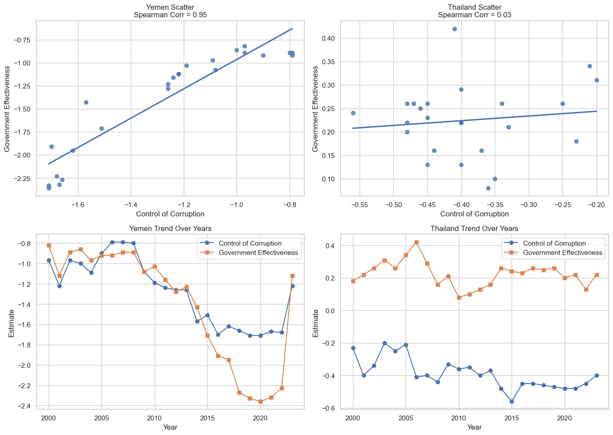

---

  
<b>Political_Stability vs Inflation</b>

 

**How does Political Stability relate to Inflation across countries?**

This data consists of Political Stability and Inflation percentage per year, both are non-normal even after applying log transformation for both of them they are still non-normal.

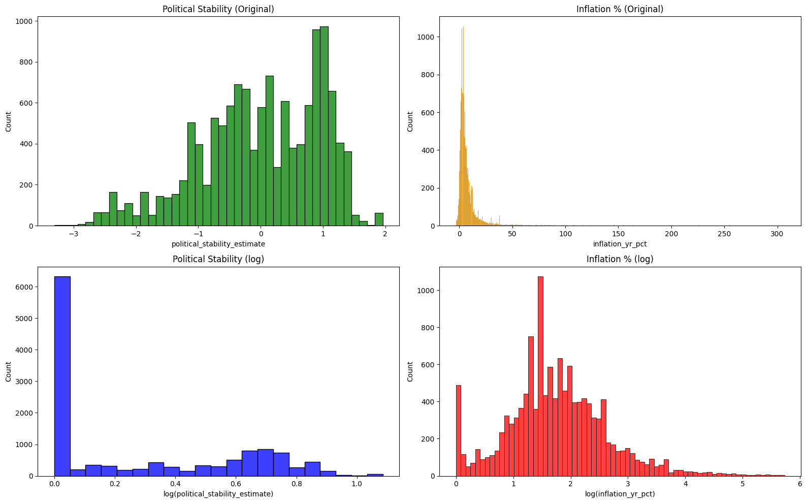

Given the non_normal data distribution, our analysis examines the relationship between political stability and inflation using Spearman correlation. Overall, there is a weak negative correlation of **−0.325**, suggesting that countries with higher political stability tend to experience slightly lower inflation, though the relationship is not strong. Additionally, examining correlations within income groups reveals that political stability’s link to inflation is generally negative across all income levels, with the effect slightly more pronounced in upper-middle-income nations.

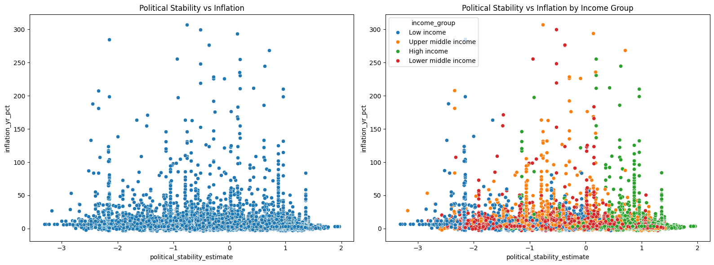

To examine whether the relationship between political stability and inflation changed after the 2008 financial crisis, we split the data into pre-2008 and post-2008 periods. The correlation remained negative in both periods, indicating that more politically stable countries generally experienced lower inflation throughout. However, the strength of the relationship shifted slightly, reflecting how major economic shocks can influence the sensitivity of inflation to political conditions.

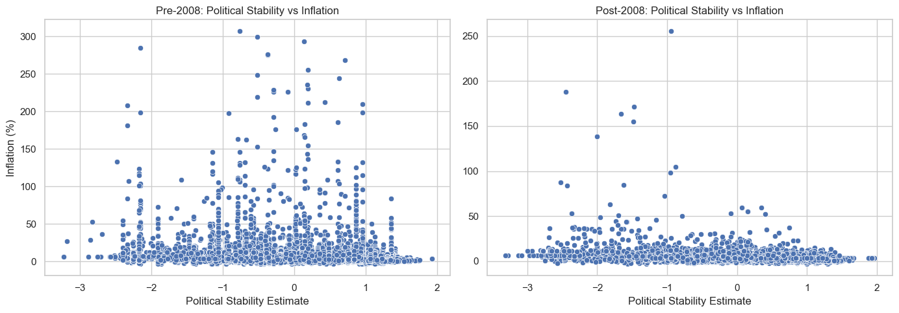

An extreme unnormal inflation occured in Indonesia in 1965, with a staggering 306.76% annual rate. This extreme value reflects a period of hyperinflation driven by severe political and economic instability, as also indicated by the negative political stability estimate (-0.76). During this time, Indonesia faced economic mismanagement, currency devaluation, and social unrest, which together caused the extraordinary surge in prices. This observation represents an outlier in the dataset.

Another unexpected observation is Mongolia in 1993, which experienced very high inflation of 268.15% despite having a relatively high political stability estimate (0.71). This apparent paradox can be explained by economic transition rather than political turmoil: during the early 1990s, Mongolia was shifting from a centrally planned economy to a market-based system. Such transitions often involve rapid price liberalization, removal of subsidies, and currency reforms, which can trigger hyperinflation even in politically stable contexts.

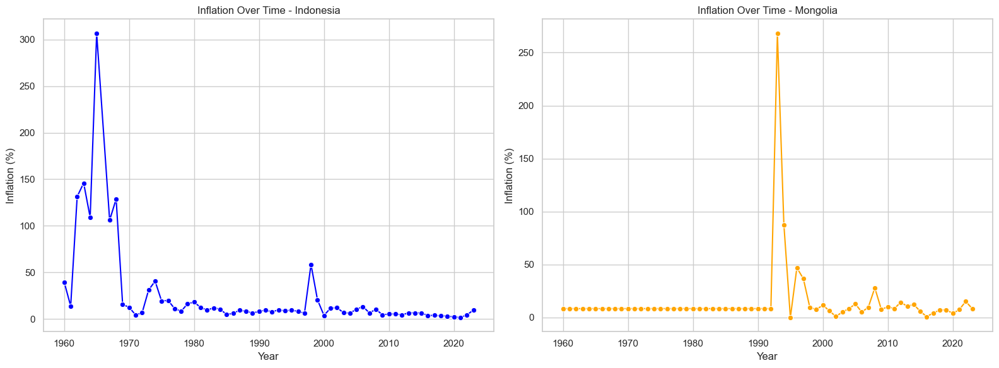

---

  
<b>GDP vs Life Expectancy</b>

 

**Does higher economic output (GDP) relate to higher life expectancy across countries, and does this relationship differ by income group and over time?**

### Data Inspection
The distributions of GDP and life expectancy were explored using histograms. GDP showed a highly right-skewed distribution, with a small number of extremely wealthy countries. Life expectancy showed a more balanced distribution with fewer extreme outliers.

Because GDP was highly skewed, a logarithmic transformation was applied to improve interpretability.

Outliers were not removed from the dataset. Instead, a log10 transformation was applied to GDP values to reduce skewness and limit the influence of extreme observations. This allowed the analysis to retain real-world variation while improving the interpretability of the relationship. Boxplots are shown to visualize the presence of extreme values before transformation.

**Figures:**  
 
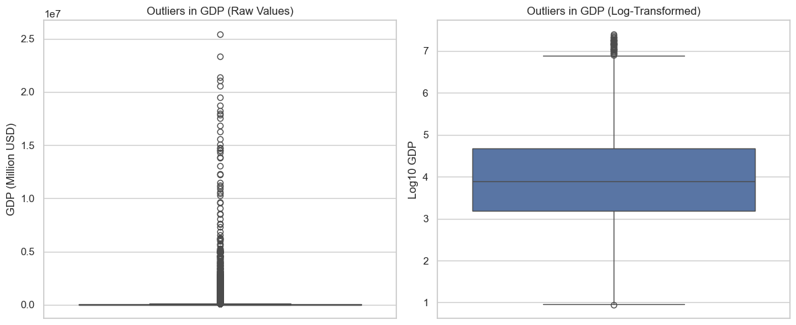

### Visualization
A scatter plot of log(GDP) against life expectancy shows a clear upward trend. Countries with higher GDP tend to have higher life expectancy. However, the pattern flattens at very high income levels, suggesting diminishing returns.

A grouped scatter plot shows high-income countries clustering at high GDP and life expectancy, while low -income countries cluster at lower values.

**Figures:**  
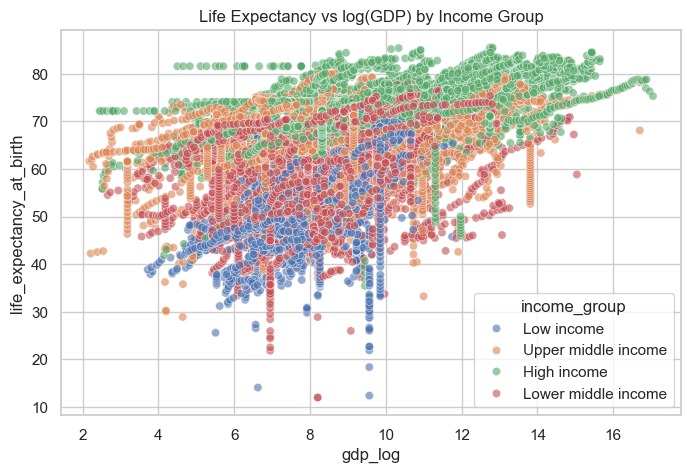

### Statistical Test
Both Pearson and Spearman correlations were computed:

- **Pearson r = 0.443 (p < 0.001)**
- **Spearman ρ = 0.471 (p < 0.001)**

A Shapiro normality test was performed. Log-transformed GDP was approximately normally distributed (p = 0.216), while life expectancy significantly deviated from normality (p < 0.001). Because the normality assumption was violated for at least one variable, Spearman’s rank correlation was chosen as the primary method.

The results indicate a moderate positive relationship between GDP and life expectancy, meaning countries with higher economic output tend to show higher life expectancy.

### Group-Level Analysis (Income Groups)
Correlation by income group:

- Low income: ρ = 0.351  
- Lower-middle income: ρ = 0.331  
- Upper-middle income: ρ = 0.295  
- High income: ρ = 0.474  

The relationship is strongest in high-income countries and weaker in middle-income groups, particularly in upper-middle income countries.

### Temporal Analysis (Pre vs Post 2008)
The relationship was tested before and after the 2008 financial crisis:

- **Pre-2008: ρ = 0.422**  
- **Post-2008: ρ = 0.450**

The positive relationship remained stable over time.

**Figures:**  
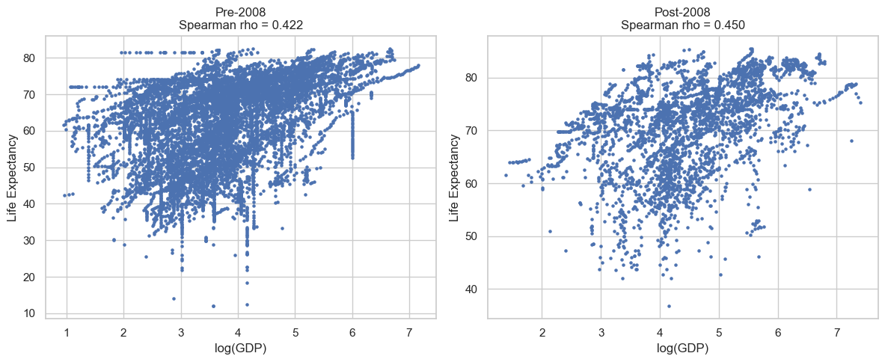

### Interpretation
Countries with higher economic resources tend to have higher life expectancy. This effect is stronger in poorer countries. The results show correlation, not causation as GDP alone does not cause better health. Factors like governance, healthcare systems, and education also play important roles.

### Main Takeaway
Economic growth and human well-being are strongly connected, but wealth alone is not enough. How resources are used becomes more important as countries become richer.

---

  
<b>CO₂ emissions vs Renewable Energy Use</b>

 

**Is there a correlation between CO₂ emissions per capita and renewable energy consumption across different countries and times?**

This analysis investigates how CO₂ emissions per capita relate to renewable energy consumption globally. The analysis was performed only for the year 2023 as a subset of the entire data. Initially, outliers were identified and stripped off with a threshold value of 18.45:

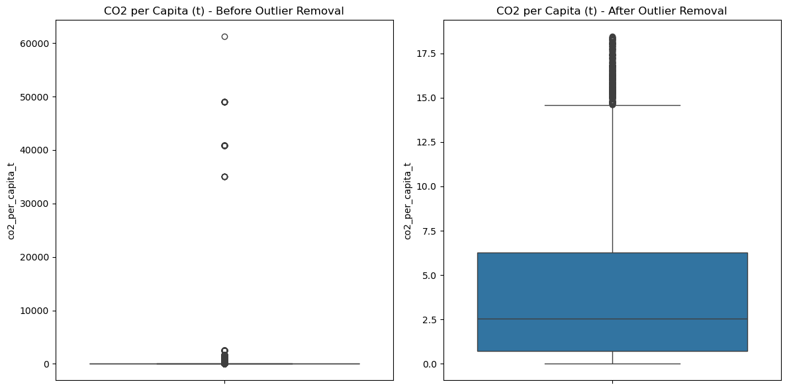

The histograms showing the spread were as follows:

### Global Perspective
The two world maps show opposing trends: In the Global North high CO₂ per capita emissions are observed while renewable energy consumption is, relatively speaking, low. In contrast, in the Global South, and especially in sub-Saharan Africa, low CO₂ emissions and moderate to high renewable energy consumption are seen.

The scatterplot reflects the spatial distribution and trend that was already visible in the world map. As the data is not normally distributed (Poisson-like), the Spearman's correlation coefficient was used for obtaining the correlation coefficient. The correlation is negative and high (=-0.76), i. e., the higher the CO₂-per-capita-emissions, the lower the market share / consumption of renewables.

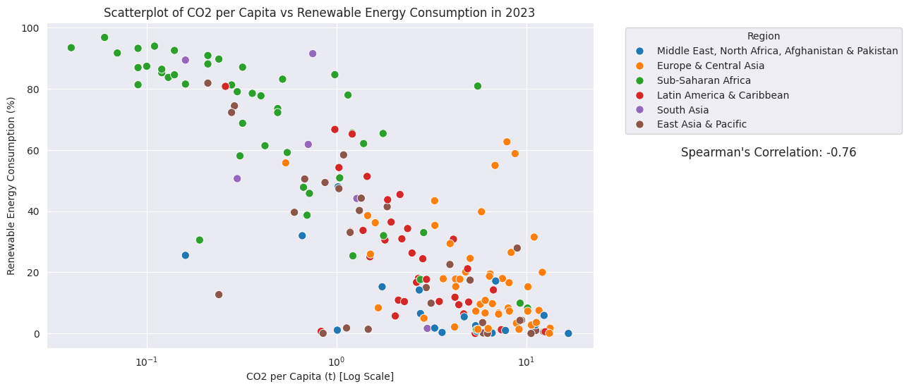

### Case Study: Germany
As can be seen in the figure, Germany has experienced a steady decrease in CO₂ emissions while investing in renewable energy. The correlation is very high (=-0.98). This clear trend seems to reflect the country's ambition regarding energy transition ("Energiewende") in face of climate change and, hence, even a causality might be implied here. However, this cannot be understood from the data alone but needs 

---

  
<b>Government effectiveness Vs Government expenditure on education</b>

 

**Is there a relationship between government effectiveness and government expenditure on education (% of GDP) across countries?**

### Data Inspection
The distributions of government effectiveness and education expenditure (% of GDP) were explored using histograms. Government effectiveness scores ranged from negative to positive values, reflecting weaker to stronger governance across countries. Education expenditure was highly right-skewed, with some countries allocating much larger shares of GDP to education than others.

Because education expenditure was highly skewed, a logarithmic transformation was applied to improve interpretability.

Outliers were not removed from the dataset. Instead, a log10 transformation was applied to education expenditure values to reduce skewness and limit the influence of extreme observations. This approach allowed the analysis to retain real-world variation while improving the interpretability of the relationship. Boxplots are shown to visualize the presence of extreme values before transformation.

**Figures:**  
 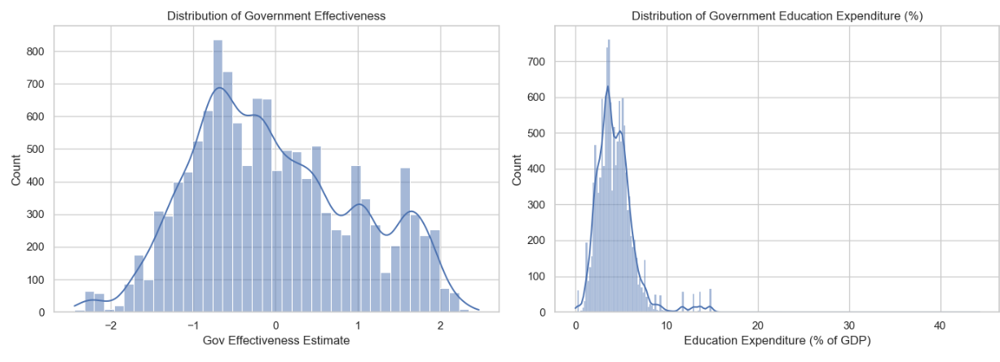
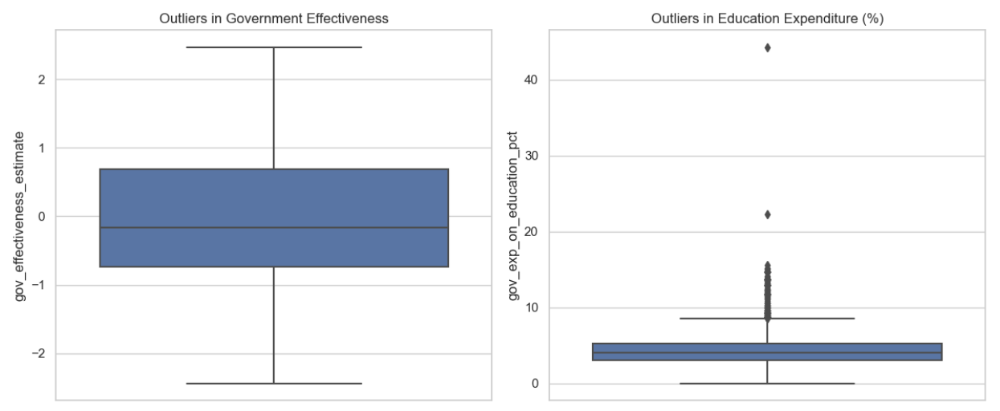

### Visualization
A scatter plot of government effectiveness against education expenditure (% of GDP) shows a positive but relatively weak association. Most countries cluster at lower education expenditure values (0–10%), while government effectiveness ranges from negative to positive scores. A few countries have unusually high education spending (above 20%), which appear as outliers.

The relationship is not strongly linear—increases in government effectiveness are generally associated with slightly higher education spending, but there is considerable variation, especially among middle and high governance scores. This indicates that while better governance tends to correlate with higher investment in education, other factors also play a role.

**Figures:**  
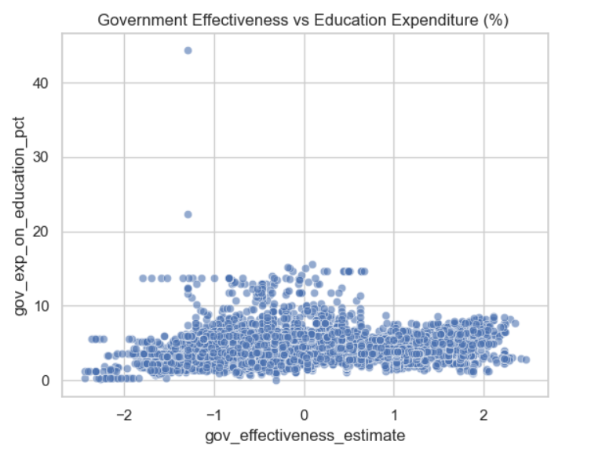

### Statistical Test
Both Pearson and Spearman correlations were computed:

- **Pearson r = 0.278 (p < 0.001)**
- **Spearman ρ = 0.272 (p < 0.001)**

A moderate positive relationship was found between government effectiveness and education expenditure. The Spearman correlation showed ρ = 0.272 (p < 0.001), and the Pearson correlation showed r = 0.278 (p < 0.001), indicating that countries with higher government effectiveness tend to allocate a larger share of GDP to education. While the association is statistically significant, the strength is moderate, suggesting that government effectiveness is an important, but not the only, factor influencing public investment in education.

### Group-Level Analysis (Income Groups)
Correlation by income group:

- Low income: ρ = 0.416  
- Lower-middle income: ρ = 0.204  
- Upper-middle income: ρ = 0.1  
- High income: ρ = 0.296  

The relationship is strongest in Low-income countries and weaker in higher income groups, particularly in upper-middle income countries.

### Temporal Analysis (Pre vs Post 2008)
The relationship was tested before and after the 2008 financial crisis:

- **Pre-2008: ρ = 0.272**  
- **Post-2008: ρ = 0.272**

The positive relationship remained stable over time.

**Figures:**  
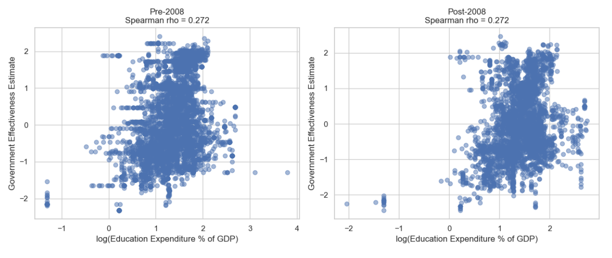

### Interpretation
Although government effectiveness and education expenditure are positively correlated, this does not prove causation. Higher governance scores do not automatically cause higher spending. Other factors, such as GDP, political priorities, population size, and historical policy decisions, may also influence education expenditure.

### Main Takeaway
The analysis shows that governance quality and investment in education are positively connected, especially in lower-income countries. However, improving governance alone is not enough — how resources are allocated and used also matters, particularly in higher-income countries.

---

  
<b>AI Disclaimar</b>

 

- Use of Visual Studio / PyCharm with Github copilot (inline code suggestions) 
- AI was used to find out particular countries with contrasting patterns (Yemen, Thailand)
- AI was used to compile graphs in single subplots/tightplots for the final report

