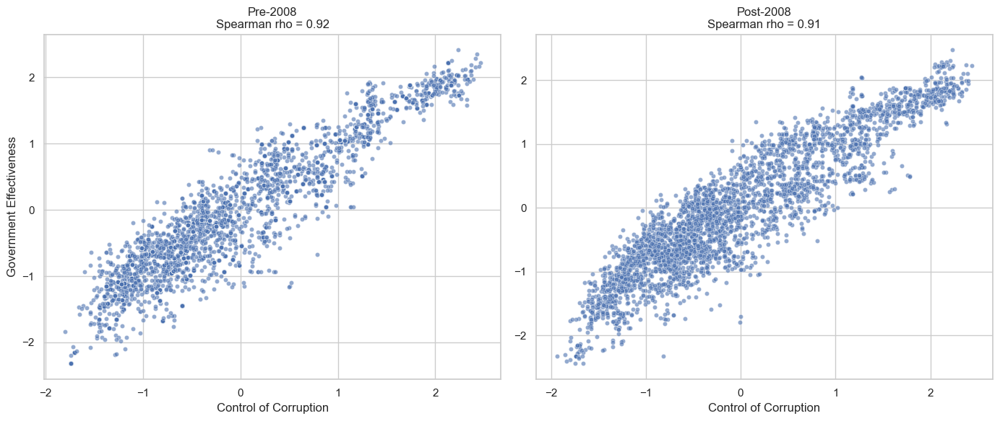

# World Bank Report Analysis

| Name      | Contribution                         |
|:----------|:-------------------------------------|
|Assad      | Corruption vs Gov Effectiveness, Final Report Creation |
|Zeyad     | Political Stability vs Inflation                |
|Shiva     | Life expectancy vs GDP    |
|Stefan      |CO2 vs Renewable Energies                 |
|Sumeet     |                           |

  
<b>Background</b>

 

This project uses World Bank indicators across governance, environmental sustainability, economic performance, and human well-being to understand how countries develop around the world. One important observation is that the data for most indicators is **not normally distributed**, which affects statistical testing but does not hide the overall trends.

Across all themes, a consistent trend appears: **A country's income level makes a big difference**. Wealthier nations generally have stronger institutions, better social services, and more stable economies. Poorer countries face bigger challenges but often rely more on agriculture and renewable resources. Middle-income countries are somewhere in between, balancing growth, development, and environmental pressures.

A brief summary of analysis as follows:

| **Theme** | **Indicators Selected** | **Key Patterns Observed** | **Overall Analysis** |
|----------|--------------------------|----------------------------|-----------------------------|
| **Governance** | Government effectiveness, control of corruption, rule of law, voice & accountability, political stability | None of the indicators are normally distributed; higher-income countries consistently score higher; variance is lowest in high-income countries. | Governance strength and institutional quality rise with income levels. |
| **Environment** | CO₂ emissions, renewable energy consumption %, forest land %, agricultural land % | High-income countries emit the most CO₂ but maintain stable forests; low-income countries rely heavily on agriculture and renewables; middle-income countries are transitioning. | Environmental outcomes reflect stages of development and industrialization. |
| **Economic Performance** | GDP, inflation %, tax revenue % | High-income = strong GDP and stable inflation; low-income = weak tax capacity and high inflation; middle-income = transitioning. | Higher income is linked with economic stability and stronger fiscal systems. |
| **Human Well-Being** | Life expectancy, education spending %, health spending %, access to electricity %, population density | High-income countries lead in health, education spending, and electrification; low-income countries show large gaps; population density varies independently of income. | Human well-being improves with income, except density which depends on geography. |

---

A further analysis is done by the group to independently study the correlation between various indicators from the data set and draw individual inferences. 

  
<b>Control of Corruption vs Government Effectiveness</b>

 

**How does control of corruption relate to government effectiveness across countries from 2000 to 2024, and does this relationship vary across income groups?**

The data consist of two governance indicators: control_of_corruption_estimate and gov_effectiveness_estimate. Inspection of the distributions shows that neither variable follows a normal distribution, even after attempts at log transformation. Some countries exhibit extreme values due to political crises or exceptionally stable governance systems. Given the non-normality between the two indicators, the Spearman correlation is chosen as the most appropriate statistical test for this analysis.

A scatter plot grouped by income level shows a clear positive trend, with high-income countries clustering at high values for both indicators, middle-income countries showing moderate values, and low-income countries appearing at lower levels. The spearman correlation is strongest for high-income countries (0.9) and weakest for lower-middle income countries (0.7)

The Spearman correlation for the overall dataset is **0.918** with a p-value < 1e-10, indicating a very strong and statistically significant positive relationship between control of corruption and government effectiveness.

As expected, a temporal analysis showed similar trends pre and post 2008 as can be seen below:

Additional analysis for selected countries highlight the two extreme dynamics: 

1. Yemen is a country that has had political instability, civil war, and governance challenges over the past 20+ years. Because of this instability, both corruption control and government effectiveness fluctuate together (mostly both deteroriate together) and hence correlation is one of the highest.

2. Thailand is a relatively stable country and small changes in corruption and government effectiveness don’t always happen together. In some years, government effectiveness may improve slightly due to reforms, while corruption stays nearly the same. In other years, corruption may worsen a bit, but overall government effectiveness does not change much. This uncoordinated movement means that year-to-year fluctuations are not aligned, which is why the correlation between the two indicators is low.

---

  
<b>Political_Stability vs Inflation</b>

Add all Group Difference analysis details here.

---

  
<b>GDP vs Life Expectancy</b>

Text here

---

  
<b>CO2 emissions vs Renewable Energy Use</b>

Text here

---

