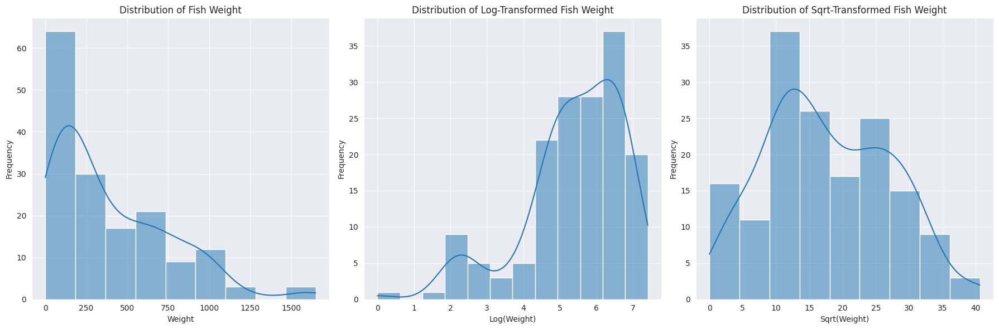
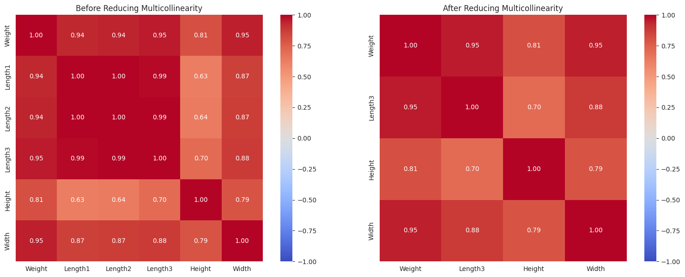
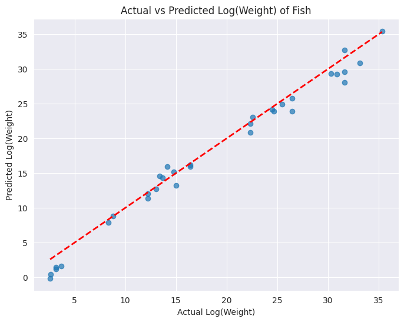
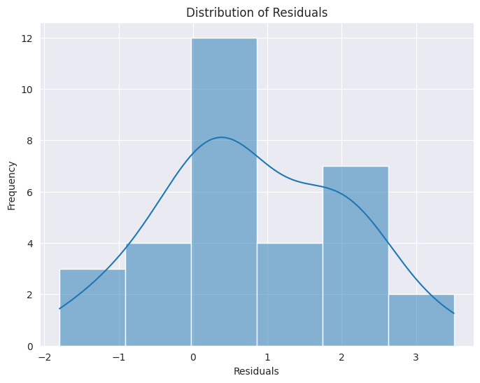

## 0. Authors of the report

| Name      | Contribution |
|:----------|:-------------|
|Stefan     | Everything   |

## 1. Dataset Overview (of the clean version)

| Item                                                   | Description                                                             |
|:-------------------------------------------------------|:------------------------------------------------------------------------|
| Dataset name                                           | Fish Market                                                                    |
| Number of rows                                         | 159                                                                     |
| Number of columns                                      | 7                                                                       |
| Format file (.csv, .txt, etc)                          | .csv                                                                    |
| Authors of the dataset                                 | Vipul L Rathod (CC0: Public Domain)                                                                       |
| Source (name)                                          | Github                                                                  |
| Source (link)                                          | [Link](https://www.kaggle.com/datasets/vipullrathod/fish-market/data) |

## 2. Dataset Structure

| Feature/variable                  | Data type   | Description               |   # Unique values | Eg. values                      |
|:----------------------------------|:------------|:--------------------------|------------------:|:--------------------------------|
| Species                           | object      | Species name              |               159 | 'Bream'                         |
| Weight                              | float64      | Weight of fish in gram    |               159 | 242                             |
| Length1                            | float64      | Vertical length in CM     |                 159 | 23.2                            |
| Length2                      | float64      | Diagonal length in CM     |                 159 | 25.4                            |
| Length3                  | float64      | Cross length in CM       |                 159 | 30                |
| Height                              | float64       | Height in CM       |                159 | 11.52                    |
| Width             | float64     | Diagonal width in CM |              159 | 4.02              |

## 3. Data cleaning 

_already cleaned dataset_

## 4. Descriptive statistics

### Numeric Columns

|  | Weight | Length1 | Length2 | Length3 | Height | Width |
| :--- | :--- | :--- | :--- | :--- | :--- | :--- |
| count | 159.000000 | 159.000000 | 159.000000 | 159.000000 | 159.000000 | 159.000000 |
| mean | 398.326415 | 26.247170 | 28.415723 | 31.227044 | 8.970994 | 4.417486 |
| std | 357.978317 | 9.996441 | 10.716328 | 11.610246 | 4.286208 | 1.685804 |
| min | 0.000000 | 7.500000 | 8.400000 | 8.800000 | 1.728400 | 1.047600 |
| 25% | 120.000000 | 19.050000 | 21.000000 | 23.150000 | 5.944800 | 3.385650 |
| 50% | 273.000000 | 25.200000 | 27.300000 | 29.400000 | 7.786000 | 4.248500 |
| 75% | 650.000000 | 32.700000 | 35.500000 | 39.650000 | 12.365900 | 5.584500 |
| max | 1650.000000 | 59.000000 | 63.400000 | 68.000000 | 18.957000 | 8.142000 |

### Categorical / Object Columns

|                                  | Species   |
|:---------------------------------|:----------|
| Count                            | 159       |
| Number of unique values          | 7         |
| Most frequent value              | Perch     |
| Most frequent value (frequency)  | 56        |
| Least frequent value             | Whitefish |
| Least frequent value (frequency) | 6         |

## 5. Analysis - Research question
### Question/hypothesis
**Hypothesis:** 
The weight of fish can be estimated based on their length, width, and height.

### Assumption check: Is weight a normally distributed variable?

**Answer:** 
The dependent variable is not normally distributed and only the sqrt transformation yields a more symmetric distribution. Thus, we will proceed with the sqrt transformed weight and check the residual distributions later.

### Assumption check: Are variables multicollinear, i.e., redundant?

_- based on correlations:_

_- based on the variance inflation factor_

| Variable           | VIF          |
|:-------------------|:-------------|
| 0   Weight         | 55.110838    |
| 1  Length1        | 13607.947089 |
| 2  Length2        | 16752.282952 |
| 3  Length3         | 3561.199815  |
| 4   Height         | 91.380963    |
| 5    Width         | 93.163705    |

**Answer:** 
Due to the high VIF and the similar correlation, Length1 and Length2 are dropped while Length3 is kept as it is the most representative length measure (combination of both).

### Modelling
**Comment:**
Due to our research hypothesis, we will use a linear regression model to predict the weight of fish based on their Length3 (i.e. cross length), Height, and Width.

#### Evaluation Metrics

| Metric                          | Value    |
|:-------------------------------|:---------|
| Mean Absolute Error (MAE)      | 1.1723   |
| Root Mean Squared Error (RMSE) | 1.4747   |
| Mean Absolute Percentage Error (MAPE) | 15.19% |
| R^2 Score                      | 0.9783   |

**Answer:**
The two plots above show the predicted vs actual values and the histogram of the residuals. The predicted vs actual values plot indicates that the model performs well, as the points are closely aligned with the diagonal line. The histogram of the residuals appears to be approximately normally distributed, suggesting that the model assumptions are reasonably met.

### Final summary

The linear regression model was trained to predict the square root transformed weight of the fish species under consideration based on their cross length, weight, and height. The model resulted in an R² score of approximately 0.98 on the test set, which can be interpreted as a strong fit. Further improvements could involve exploring non-linear models or incorporating additional features (e.g., species as a dummy variable).

### 6. AI Disclaimer
- Use of PyCharm with Github copilot (inline code suggestions) 
