# Metro Interstate Traffic Volume

## Authors

| Name      | Contribution                         |
|:----------|:-------------------------------------|
|Assad      | Data loading, cleaning, analysis, report  |
|Zeyad     | Data Analysis                |
|Shiva     |     |
|Stefan      |                 |
|Sumeet     |                |

---
## Dataset Overview

| **Item**                | **Description**                                                                 |
|-------------------------|---------------------------------------------------------------------------------|
| **Dataset Name**        | Metro Interstate Traffic Volume                                                 |
| **Time Period**         | 2012–2018                                                                       |
| **Sampling Frequency**  | Hourly observations                                                             |
| **Number of Rows**      | 48,204                                                                          |
| **Number of Columns**   | 9                                                                               |
| **File Format**         | `.csv`                                                                          |
| **Dataset Creator**     | John Hogue                                                                      |
| **Source (Repository)** | UC Irvine Machine Learning Repository                                           |
| **Source Link**         | https://archive.ics.uci.edu/dataset/492/metro+interstate+traffic+volume         |
| **Date Accessed**       | 04 December 2025                                                                |

---
## Dataset Structure

| Feature / Variable   | Data Type      | Description                         | Unique Values   | Example Values                                                |
|:---------------------|:---------------|:------------------------------------|--------------------------:|:--------------------------------------------------------------|
| holiday              | object         | Whether the day is a US holiday     |                        11 | Columbus Day, Veterans Day, Thanksgiving Day                  |
| temp                 | float64        | Average temperature in Kelvin       |                      5843 | 288.28, 289.36, 289.58                                        |
| rain_1h              | float64        | Rainfall amount in last 1 hour (mm) |                       372 | 0.0, 0.25, 0.57                                               |
| snow_1h              | float64        | Snow amount in last 1 hour (mm)     |                        12 | 0.0, 0.51, 0.32                                               |
| clouds_all           | int64          | Cloud cover (%)                     |                        60 | 40, 75, 90                                                    |
| weather_main         | object         | Main weather condition              |                        11 | Clouds, Clear, Rain                                           |
| weather_description  | object         | Detailed weather condition          |                        38 | scattered clouds, broken clouds, overcast clouds              |
| date_time            | datetime64[ns] | Timestamp of observation            |                     40575 | 2012-10-02 09:00:00, 2012-10-02 10:00:00, 2012-10-02 11:00:00 |
| traffic_volume       | int64          | Traffic volume recorded             |                      6704 | 5545, 4516, 4767                                              |

---
## Data Cleaning

| **Issue**                 | **Columns Affected**      | **Description of the Issue**                                   | **Action Taken**                                   |
|---------------------------|---------------------------|------------------------------------------------------------------|----------------------------------------------------|
| Wrong data types          | `date_time`      | date_time column existed as an object      | Converted to datetime format |
| Time gaps                 | `date_time`               | Irregular timestamps and missing hourly entries                   | Identified missing values through a heat map; selected 2017 as the final column for modeling  |
| Duplicates                | None               | N/A                                           | N/A             |
| Inconsistent categories   | `weather_main`, `holidays`  | Lots of unique entries in weather_main, NaN entries in holidays                         | Grouped weather_main into similar categories and did one-hot encoding                    |
| Other                     | `weather_description`, `rain_1h`, `snow_1h`                         | weather_description had even more unique values which would make the model very messy, rain_1h and snow_1h were not captured throughout 2017                            | Dropped these columns    |

 

### HeatMap for yearly missing data
 

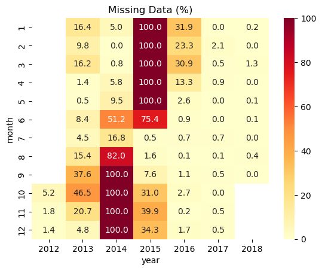

Based on the above HeatMap (made with Jannik's help), we selected **2017** simply because it is the only year with consistent, high-quality data. While 2014 is virtually empty and other years are too patchy to trust, 2017 is nearly 100% complete. This ensures our model learns from actual traffic patterns rather than noise or guesses.

---
## Descriptive Statistics

|                    |   traffic_volume |        temp |   clouds_all |
|:-------------------|-----------------:|------------:|-------------:|
| Count              |  10605           | 10605       |   10605      |
| Mean               |   3340.7         |     8.31331 |      50.0053 |
| Standard Deviation |   1986.51        |    11.5458  |      39.5123 |
| Min                |    186           |   -27       |       0      |
| 25%                |   1292           |     0.13    |       1      |
| 50%                |   3530           |     9.2     |      75      |
| 75%                |   4984           |    17.6     |      90      |
| Max                |   7280           |    33.87    |      92      |
| Variance           |      3.94621e+06 |   133.306   |    1561.22   |
| Dispersion Index   |   1181.25        |    16.0352  |      31.2212 |

 

## Basic Statistical Plots

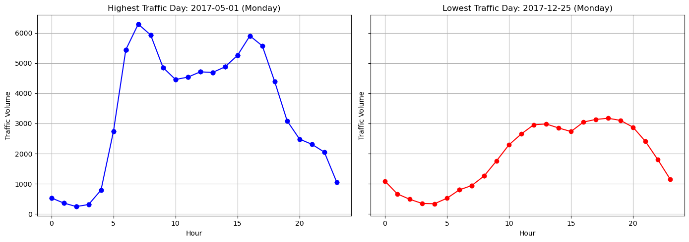
 
While playing with data, we decided to check the day with the highest and lowest traffic and found the following results:
 

**May 1st (Highest Traffic)**: Massive May Day Protests on a Monday (already a busy day). 
**December 25th (Lowest Traffic)**: Christmas holiday, so people probably stayed home.

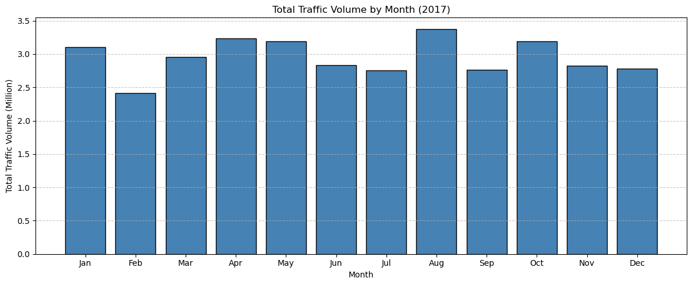

Also, explored the monthly traffic patterns:

**February**: Typically the peak of the harsh Minnesota winters, temperature drops to -11.  
**August**: Busiest month because of great weather, Minnesota State Fair (one of the largest in the country), Construction Season.  

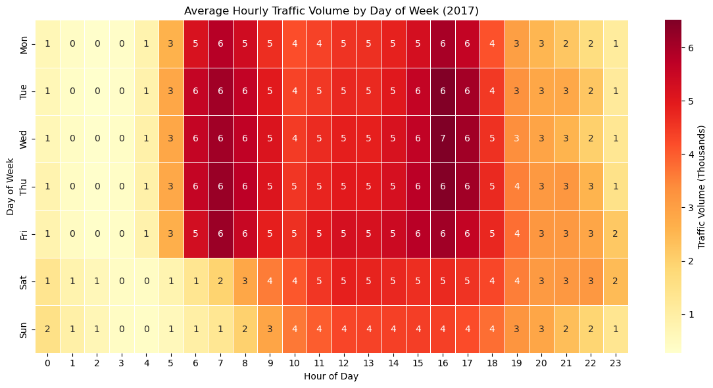

The heatmap reveals a stark contrast between workdays and weekends: Monday through Friday show distinct morning and evening commute spikes, while weekends exhibit a much smoother, lower-volume pattern. 

Weekday traffic is concentrated between **06:00 and 18:00**, with clear peaks at 07:00 and 17:00 that reflect the standard office timings

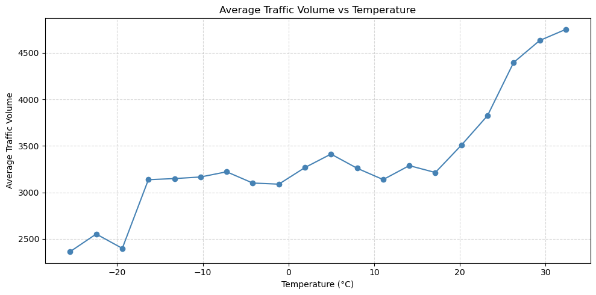

While traffic flow remains stable across cold and mild weather (roughly -15°C to 15°C), we observe a sharp surge in volume as temperatures exceed **20°C**, suggesting a strong increase in road usage during warmer conditions.

---
## Model Comparison Results

### Why OLS is not feasible?

The department's prediction of not using OLS seems to be reasonable because Ordinary Least Squares regression assumes that the target variable is normally distributed and has constant variance, but traffic volume data is highly skewed ajd count-based. This makes OLS predictions unreliable, and it can even produce negative traffic values, which are impossible in reality. Just to have a glimpse on the traffic distribution:

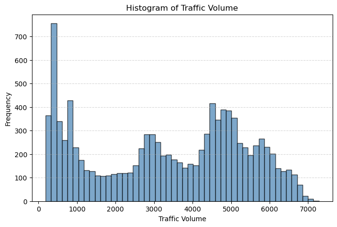

### Testing Poisson Regression

To move beyond the limitations of OLS, we started with the standard model for count data: Poisson regression. This model ensures our predictions remain strictly non-negative. We modeled the relationship between our independent variables specifically time, holidays, and weather conditions (clouds, temperature) and the traffic volume. The outputs of Poisson Regression were as follows:

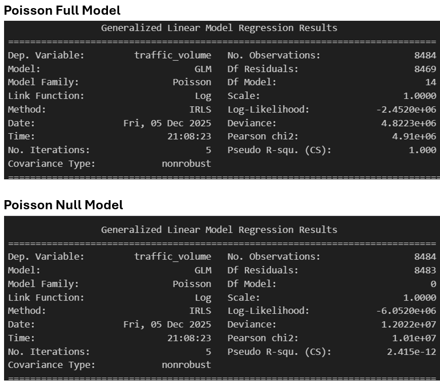

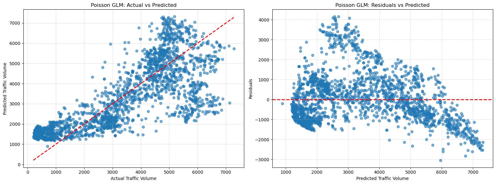

The Actual vs Predicted graph shows the model is generally performing well, as the blue points follow the red trend line. However, the pattern in the Residuals plot (Funnel Shape) indicates that the spread of residuals gets wider as the predicted value increases, visually signalling the overdispersion in data.

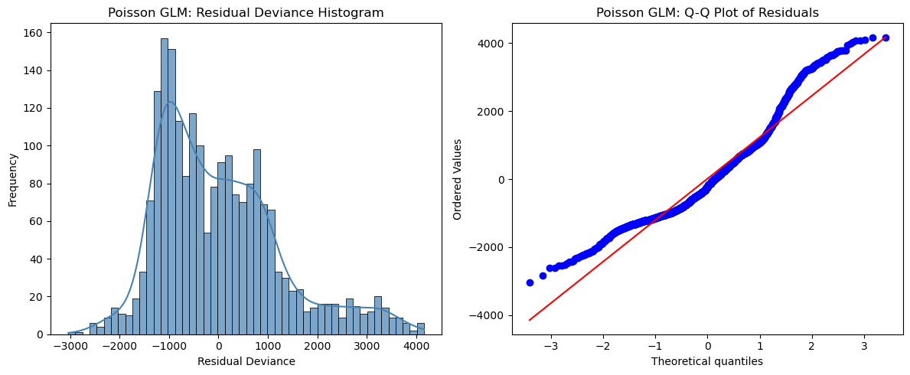

The residual histogram and Q-Q plots further confirms that there is a huge difference between the mean and variance of our data (Mean: 3,340, Variance: 3,946,208). This breaks the Poisson rule that they should be equal. The Q-Q plot shows this where the blue dots peel away from the red line at both ends because the model can't handle the extreme highs and lows of real-world traffic.

### Testing Negative Binomial Regression

We now switch to a Negative Binomial regression, which is specifically designed to handle overdispersed data by adding an extra parameter alpha or the dispersion parameter (61.55 in our case) that allows for the wider spread and volatility seen in real-world traffic volume.

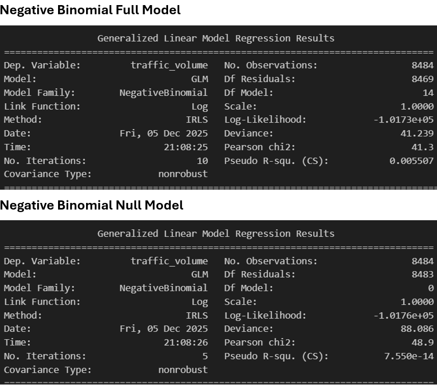

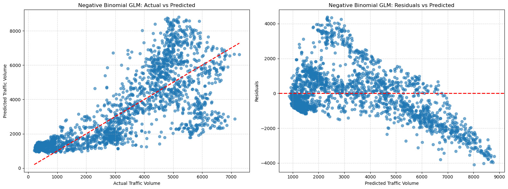

The Actual vs Predicted graph confirms the model captures the general trend, with the blue dots correctly following the red line upward as traffic increases. While the Residuals plot still displays a funnel shape, the Negative Binomial framework handles this variance in a much better way, evidenced by the Pearson Chi-Square massively dropping from 4.9 million to 41.3.

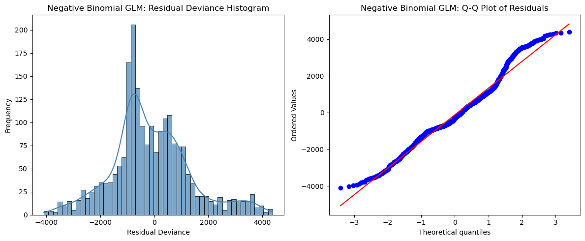

The Q-Q Plot shows a massive improvement, with the blue dots now more close to the red line instead of peeling away, confirming the model finally handles extreme traffic highs and lows in a better way. 

### Overall conclusion

Although the Poisson model seemed strong at first with a high McFadden’s R² of 0.59, the extremely large Pearson Chi-Square shows that it suffers from severe overdispersion, making the model unreliable. 
The Negative Binomial model fixes this issue, bringing the deviance and Pearson Chi-Square down to realistic levels. However, once the variance is properly handled, we see that the predictors explain very little of the variation in traffic, which is why the McFadden’s R² becomes almost zero.
The overall metrics comparing the two models are listed below:

| **Metric**                     | **Poisson**                    | **Negative Binomial**               |
|-------------------------------|---------------------------------|-------------------------------------|
| **AIC**                       | 4,904,046.99                    | 203,497.47                          |
| **Log-Likelihood (Full)**     | -2,452,008.50                   | -101,733.74                         |
| **Log-Likelihood (Null)**     | -6,051,981.14                   | -101,757.16                         |
| **McFadden’s R²**             | 0.59484                         | 0.00023                             |
| **Deviance**                  | 4,822,291.17                    | 41.24                               |
| **Pearson Chi-Square**        | 4,910,488.10                    | 41.27                               |

Lastly, after trying the Likelihood Ratio Test between Poisson and Negative Binomial, we got the LR statistic value of **4,700,549**. This further gives the evidence that the Negative Binomial model fits the data far better than the Poisson model due to extreme overdispersion.

---
## AI Disclaimar

VS Copilot was used as well as other AI tools were used to take help in modelling issues and better graphical outputs. 

