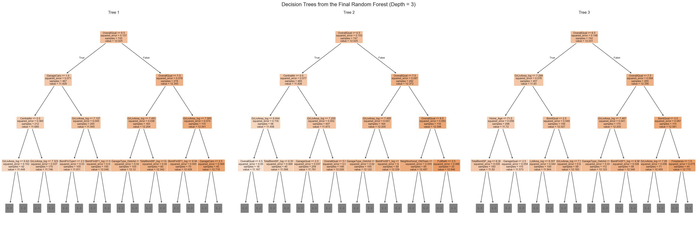
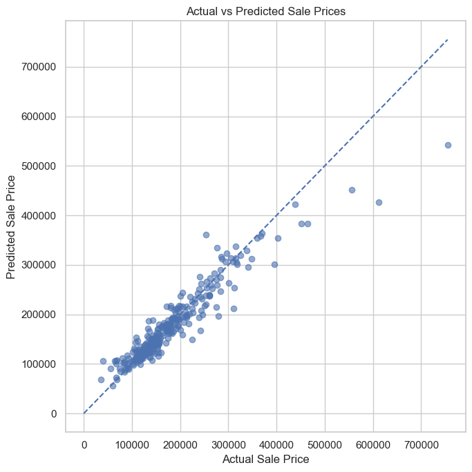
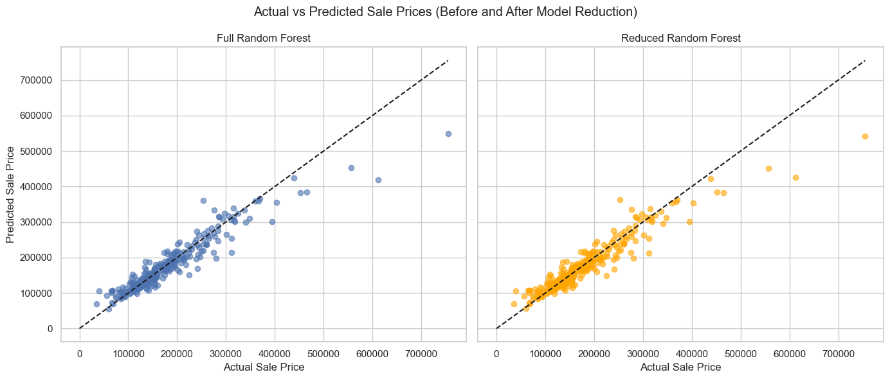
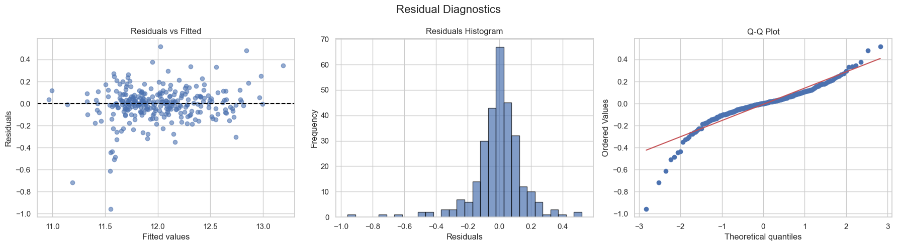

# Housing Analysis

| Name      | Contribution                         |
|:----------|:-------------------------------------|
|Assad      | Data Cleaning, Analysis, Report      |
|Zeyad      | Random Forest Model, Report          |
|Raghavendra| GLM                                  |
|Sumeet     | Data processing and cleaning         |
|Stefan     |                                      |

## Dataset Overview

| **Item**                | **Description**                                                                    |
|-------------------------|------------------------------------------------------------------------------------|
| **Dataset Name**        | Ames Housing Dataset                                                               |
| **Number of Rows**      | 1,460                                                                              |
| **Number of Columns**   | 81                                                                                 |
| **File Format**         | `.csv`                                                                             |
| **Source (Name)**       | Github                                                                             |
| **Source Link**         | https://github.com/datagus/ASDA2025/blob/main/datasets/homework_week9/housing.csv  |
| **Date Accessed**       | 11 December 2025                                                                   |

## Dataset Structure

### Numerical Features: 

| Feature / Variable   | Short Description                           |   # of Unique Values | Example Values         |
|:---------------------|:--------------------------------------------|---------------------:|:-----------------------|
| Id                   | Unique identifier for each house            |                 1460 | 1, 2, 3                |
| MSSubClass           | Dwelling Type involved in the sale          |                   15 | 60, 20, 70             |
| LotFrontage          | Feet of street connected to property        |                  110 | 65.0, 80.0, 68.0       |
| LotArea              | Lot size in square feet                     |                 1073 | 8450, 9600, 11250      |
| OverallQual          | Overall material and finish quality         |                   10 | 7, 6, 8                |
| OverallCond          | Overall condition rating                    |                    9 | 5, 8, 6                |
| YearBuilt            | Original construction year                  |                  112 | 2003, 1976, 2001       |
| YearRemodAdd         | Remodel year                                |                   61 | 2003, 1976, 2002       |
| MasVnrArea           | Masonry veneer area (sq ft)                 |                  327 | 196.0, 0.0, 162.0      |
| BsmtFinSF1           | Finished basement area type 1 (sq ft)       |                  637 | 706, 978, 486          |
| BsmtFinSF2           | Finished basement area type 2 (sq ft)       |                  144 | 0, 32, 668             |
| BsmtUnfSF            | Unfinished basement area (sq ft)            |                  780 | 150, 284, 434          |
| TotalBsmtSF          | Total basement area (sq ft)                 |                  721 | 856, 1262, 920         |
| 1stFlrSF             | First floor area (sq ft)                    |                  753 | 856, 1262, 920         |
| 2ndFlrSF             | Second floor area (sq ft)                   |                  417 | 854, 0, 866            |
| LowQualFinSF         | Low-quality finished area (sq ft)           |                   24 | 0, 360, 513            |
| GrLivArea            | Above-ground living area (sq ft)            |                  861 | 1710, 1262, 1786       |
| BsmtFullBath         | Basement full bathrooms                     |                    4 | 1, 0, 2                |
| BsmtHalfBath         | Basement half bathrooms                     |                    3 | 0, 1, 2                |
| FullBath             | Full bathrooms above grade                  |                    4 | 2, 1, 3                |
| HalfBath             | Half bathrooms above grade                  |                    3 | 1, 0, 2                |
| BedroomAbvGr         | Bedrooms above grade                        |                    8 | 3, 4, 1                |
| KitchenAbvGr         | Kitchens above grade                        |                    4 | 1, 2, 3                |
| TotRmsAbvGrd         | Total rooms above grade                     |                   12 | 8, 6, 7                |
| Fireplaces           | Number of fireplaces                        |                    4 | 0, 1, 2                |
| GarageYrBlt          | Garage construction year                    |                   97 | 2003.0, 1976.0, 2001.0 |
| GarageCars           | Garage car capacity                         |                    5 | 2, 3, 1                |
| GarageArea           | Garage area (sq ft)                         |                  441 | 548, 460, 608          |
| WoodDeckSF           | Wood deck area (sq ft)                      |                  274 | 0, 298, 192            |
| OpenPorchSF          | Open porch area (sq ft)                     |                  202 | 61, 0, 42              |
| EnclosedPorch        | Enclosed porch area (sq ft)                 |                  120 | 0, 272, 228            |
| 3SsnPorch            | Three-season porch area (sq ft)             |                   20 | 0, 320, 407            |
| ScreenPorch          | Screen porch area (sq ft)                   |                   76 | 0, 176, 198            |
| PoolArea             | Pool area (sq ft)                           |                    8 | 0, 512, 648            |
| MiscVal              | Value of miscellaneous feature              |                   21 | 0, 700, 350            |
| MoSold               | Month sold                                  |                   12 | 2, 5, 9                |
| YrSold               | Year sold                                   |                    5 | 2008, 2007, 2006       |
| SalePrice            | Sale price of the house                     |                  663 | 208500, 181500, 223500 |

### Categorical Features

| Feature / Variable   | Short Description                         |   # of Unique Values | Example Values            |
|:---------------------|:------------------------------------------|---------------------:|:--------------------------|
| MSZoning             | General zoning classification             |                    5 | RL, RM, C (all)           |
| Street               | Type of road access                       |                    2 | Pave, Grvl                |
| Alley                | Type of alley access                      |                    2 | Grvl, Pave                |
| LotShape             | General shape of property                 |                    4 | Reg, IR1, IR2             |
| LandContour          | Flatness of the property                  |                    4 | Lvl, Bnk, Low             |
| Utilities            | Type of utilities available               |                    2 | AllPub, NoSeWa            |
| LotConfig            | Lot configuration                         |                    5 | Inside, FR2, Corner       |
| LandSlope            | Slope of property                         |                    3 | Gtl, Mod, Sev             |
| Neighborhood         | Physical location                         |                   25 | CollgCr, Veenker, Crawfor |
| Condition1           | Proximity to main conditions              |                    9 | Norm, Feedr, PosN         |
| Condition2           | Secondary proximity conditions            |                    8 | Norm, Artery, RRNn        |
| BldgType             | Type of dwelling                          |                    5 | 1Fam, 2fmCon, Duplex      |
| HouseStyle           | Style of dwelling                         |                    8 | 2Story, 1Story, 1.5Fin    |
| RoofStyle            | Type of roof                              |                    6 | Gable, Hip, Gambrel       |
| RoofMatl             | Roof material                             |                    8 | CompShg, WdShngl, Metal   |
| Exterior1st          | Primary exterior covering                 |                   15 | VinylSd, MetalSd, Wd Sdng |
| Exterior2nd          | Secondary exterior covering               |                   16 | VinylSd, MetalSd, Wd Shng |
| MasVnrType           | Masonry veneer type                       |                    3 | BrkFace, Stone, BrkCmn    |
| ExterQual            | Exterior material quality                 |                    4 | Gd, TA, Ex                |
| ExterCond            | Exterior condition                        |                    5 | TA, Gd, Fa                |
| Foundation           | Foundation type                           |                    6 | PConc, CBlock, BrkTil     |
| BsmtQual             | Basement height quality                   |                    4 | Gd, TA, Ex                |
| BsmtCond             | Basement condition                        |                    4 | TA, Gd, Fa                |
| BsmtExposure         | Basement exposure                         |                    4 | No, Gd, Mn                |
| BsmtFinType1         | Basement finished area type 1             |                    6 | GLQ, ALQ, Unf             |
| BsmtFinType2         | Basement finished area type 2             |                    6 | Unf, BLQ, ALQ             |
| Heating              | Heating system type                       |                    6 | GasA, GasW, Grav          |
| HeatingQC            | Heating quality                           |                    5 | Ex, Gd, TA                |
| CentralAir           | Central air conditioning                  |                    2 | Y, N                      |
| Electrical           | Electrical system                         |                    5 | SBrkr, FuseF, FuseA       |
| KitchenQual          | Kitchen quality                           |                    4 | Gd, TA, Ex                |
| Functional           | Home functionality                        |                    7 | Typ, Min1, Maj1           |
| FireplaceQu          | Fireplace quality                         |                    5 | TA, Gd, Fa                |
| GarageType           | Garage location/type                      |                    6 | Attchd, Detchd, BuiltIn   |
| GarageFinish         | Garage interior finish                    |                    3 | RFn, Unf, Fin             |
| GarageQual           | Garage quality                            |                    5 | TA, Fa, Gd                |
| GarageCond           | Garage condition                          |                    5 | TA, Fa, Gd                |
| PavedDrive           | Paved driveway                            |                    3 | Y, N, P                   |
| PoolQC               | Pool quality                              |                    3 | Ex, Fa, Gd                |
| Fence                | Fence quality                             |                    4 | MnPrv, GdWo, GdPrv        |
| MiscFeature          | Miscellaneous feature                     |                    4 | Shed, Gar2, Othr          |
| SaleType             | Type of sale                              |                    9 | WD, New, COD              |
| SaleCondition        | Condition of sale                         |                    6 | Normal, Abnorml, Partial  |

## Data Cleaning

| Issue                         | Names of Columns Affected                                                                                                      | Description of the Issue                                                                                                                                     | Action Taken                                                                                                                                                                      |
|------------------------------|----------------------------------------------------------------------------------------------------------------------------------|-------------------------------------------------------------------------------------------------------------------------------------------------------------|----------------------------------------------------------------------------------------------------------------------------------------------------------------------------------|
| Missing Values (Categorical) | BsmtQual, BsmtCond, BsmtExposure, BsmtFinType1, BsmtFinType2, FireplaceQu, GarageType, GarageFinish, GarageQual, GarageCond, MasVnrType | High number of missing values where `NA` indicates the absence of the feature (e.g., no basement, no garage) rather than missing data                        | Replaced `NA` with `None` to explicitly represent the non-existence of the feature and preserve its semantic meaning                                                             |
| Missing Values (Numerical)   | LotFrontage, GarageYrBlt, MasVnrArea, Electrical                                                                                  | Values were missing either due to incomplete records or because the associated feature was not present                                                     | Imputed LotFrontage using the median; imputed Electrical using the mode; replaced missing values in GarageYrBlt and MasVnrArea with 0 to indicate absence of the feature        |
| Ordinal Mapping              | ExterQual, KitchenQual, BsmtQual, FireplaceQu, BsmtCond, GarageQual, BsmtExposure, BsmtFinType1                                  | Quality-related categorical variables have an inherent order and can be meaningfully represented on a numerical scale                                      | Mapped ordinal categories to numerical scores to preserve ordering and help us later in modeling                                                           |
| Encoding                     | All remaining categorical features                                                                                                | High-cardinality categorical variables would result in a large number of binary features after one-hot encoding                                             | Grouped low-frequency categories into an `Others` category prior to encoding to reduce dimensionality while retaining the most informative distinctions                          |

### Random Forest Model

Random Forest regression model is trained using the training dataset. Random Forest is a learning method that builds many decision trees on samples of the data and averages their predictions. Unlike linear regression, it does not rely on strict assumptions such as linearity or normality, making it suitable for capturing complex, non-linear relationships between housing characteristics and sale prices, the following shows three decision trees from the Random Forest.

The Random Forest model predicts house sale prices with good accuracy. On the test set, the model’s predictions have an RMSE of about €29,450 and an R² of 0.887, meaning it captures roughly 89% of the variation in actual home prices. The following figure compares the predicted prices to the actual sale prices, showing that most predictions align closely with the observed values.

To simplify the model while retaining predictive power, we performed feature selection using a stepwise procedure based on the AIC. This method iteratively added the most informative variables, selecting a subset that balances model complexity and goodness of fit. The figure below compares actual versus predicted sale prices for the full and reduced models. As shown, the reduced model performs similarly to the full model.

The residual histogram is roughly bell‑shaped and centered near zero, and the residuals‑vs‑fitted plot shows points scattered fairly evenly around zero without a clear pattern, while the QQ‑plot lies close to the reference line except for a few tail points, so together these graphs suggest that the model errors are approximately normal with no strong misspecification.

