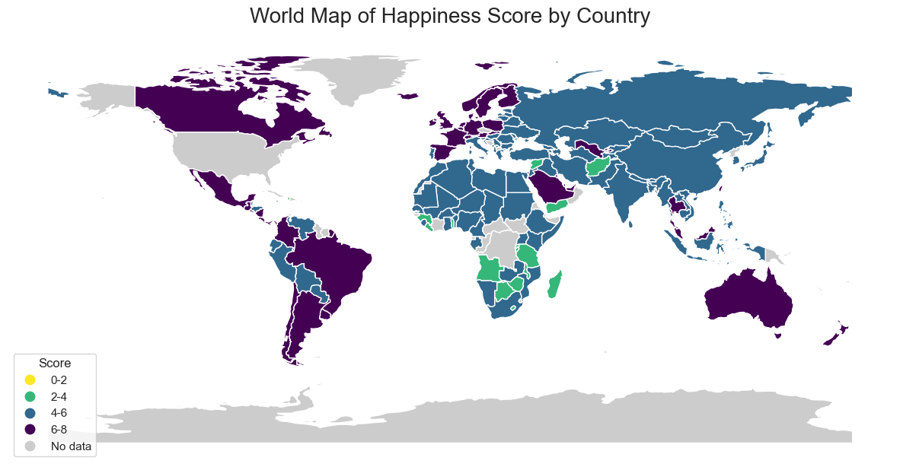
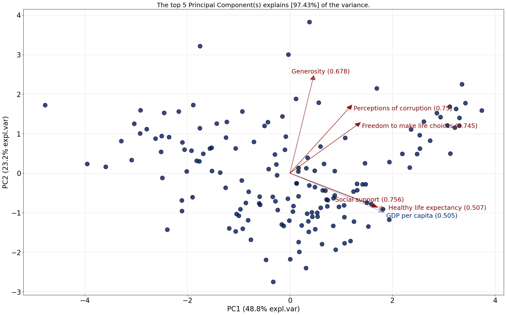
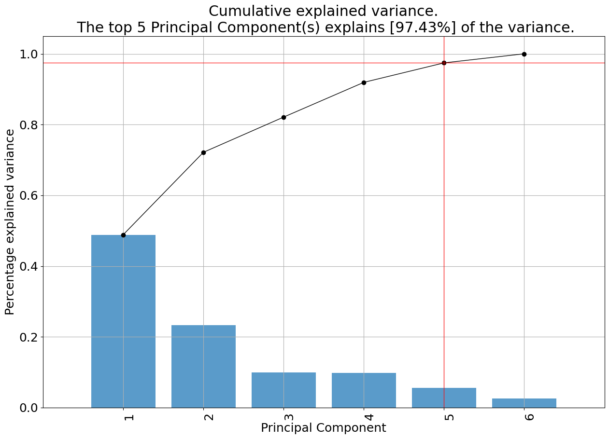
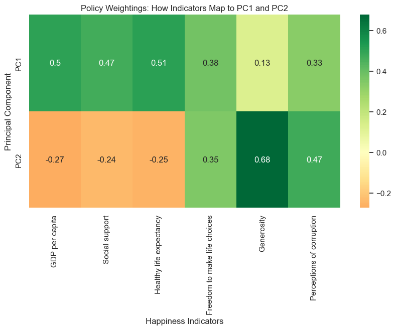
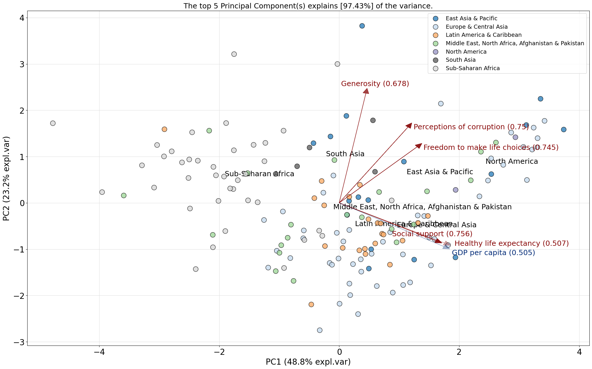

## Global Happiness Ordination: Principal Component Analysis

| Name      | Contribution                         |
|:----------|:-------------------------------------|
|Assad      | Analysis & Report |
|Stefan     | Analysis & Report               |
|Zeyad     |     |
|Raghavendra      | Analysis  |
|Sumeet     |                |

---

## Executive Summary

This report analyzes global happiness using principal component analysis (PCA) to find the main factors that influence well-being. The results show that **five key components** explain **97.4%** of the differences in happiness across countries. This means that happiness is shaped by several factors, not just one. The analysis highlights important socio-economic, and institutional influences, as well as regional differences in how these factors interact.

---

## Dataset Overview

| **Item**                | **Description**                                                                    |
|-------------------------|------------------------------------------------------------------------------------|
| **Dataset Name**        | Happiness Score Dataset                                                            |
| **Number of Rows**      | 156                                                                                |
| **Number of Columns**   | 9                                                                                  |
| **File Format**         | `.csv`                                                                             |
| **Source (Name)**       | Github                                                                             |
| **Source Link**         | https://github.com/datagus/ASDA2025/blob/main/datasets/homework_week10/happy.csv   |
| **Date Accessed**       | 18 December 2025                                                                   |

## Principal Component Analysis

To explore the key factors shaping global happiness, we applied Principal Component Analysis (PCA) to the World Happiness dataset, containing data for 156 countries. The steps followed are described below:

### 1. Data Selection

Six key indicators of well-being were selected as features for analysis:

- GDP per capita
- Social support
- Healthy life expectancy
- Freedom to make life choices
- Generosity
- Perceptions of corruption

These variables were extracted from the dataset, while country names and regions were retained as reference labels. The Overall Rank variable was excluded because it is directly derived from the happiness score. The Score variable was also removed, as it is essentially derived from the selected indicators and would therefore be redundant in the analysis. The happiness score is highest in the Americas, Europe, and Oceania as can be seen in the following figure that plots the score for each country:

### 2. Data Scaling

Before applying PCA, the selected indicators were standardized so that they are all on the same scale. This ensures that no single indicator dominates the analysis simply because of its unit or range.

### 3. PCA Implementation

PCA was then applied to the standardized data to identify the main factors driving global happiness. The analysis used the feature names to track which indicators contribute most and the countries or regions to see how they group based on these factors.

### 4. Results Visualization

Biplots were generated to visualize both the countries (and later regions) and the contribution of each feature to the principal components. This allows for interpretation of how indicators drive differences in happiness across countries.

**PCA Biplot of Global Happiness Indicators**

Top contributing features for each principal component were identified using the model’s topfeat attribute.

| PC  | Feature                         | Loading  | Type |
|-----|----------------------------------|----------|------|
| PC1 | Healthy life expectancy          | 0.507478 | Best |
| PC2 | Generosity                       | 0.677582 | Best |
| PC3 | Freedom to make life choices     | 0.744680 | Best |
| PC4 | Perceptions of corruption        | 0.749989 | Best |
| PC5 | Social support                   | 0.756395 | Best |
| PC1 | GDP per capita                   | 0.504522 | Weak |

Additional plots (e.g., model.plot()) were used to summarize variance explained and the relationships between components.

This methodology allowed us to reduce the dimensionality of the dataset, uncover the main underlying factors of global happiness, and compare how countries and regions cluster based on these factors.

## Findings

### Principal Component Analysis Dimensions

The heatmap of PC1 and PC2 provides a clear interpretation of the two most important dimensions underlying global happiness.

**PC1: Socio-Economic Foundations (48.8% of variance)**
The first principal component is primarily driven by healthy life expectancy, GDP per capita, and social support, all of which show strong and positive contributions.

*Interpretation:*
This dimension represents the everyday foundations of a good life. Countries that score highly are places where people generally live longer, earn enough to meet their needs, and can rely on support from family and community. It highlights that economic security and good health remain the starting point for happiness.

**PC2: Institutional and Social Quality (23.2% of variance)**
The second principal component is shaped mainly by generosity and perceptions of corruption, while economic factors such as GDP per capita contribute little or even negatively.

*Interpretation:*
This dimension reflects how fair, trustworthy, and supportive a society feels to its people. It shows that happiness is not only about income, but also about living in a place where institutions are trusted, corruption is low, and people are willing to help one another. These social and institutional qualities provide an additional path to well-being beyond economic development alone.

### Analyzing Regions

**PCA Biplot Categorized by World Regions**

The PCA reveals a clear global pattern. PC1 captures structural well-being, reflecting material wealth, health, and institutional strength, while PC2 captures social and communal factors, such as generosity and social cohesion.

**1. Developed Economies (North America & Europe)**
These regions have high PC1 scores, showing strong material and health foundations. Differences in PC2 reflect variation in generosity, social cohesion, and trust in institutions.

**2. Emerging Middle Ground (East Asia, Latin America & Middle East)**
Moderate scores on both PC1 and PC2 indicate a balance of material well-being and social/institutional support. Happiness in these regions relies partly on community and relationships.

**3. High Social Variance (Sub-Saharan Africa & South Asia)**
Low PC1 scores reflect limited material and health resources, while PC2 variation highlights differences in generosity, social cohesion, and cultural support.

### Analyzing Countries in PC1 and PC2

**PCA Highlights: Top Countries by Dimension**

| Top PC1 Countries       | PC1 Score | Happiness Score | Top PC2 Countries       | PC2 Score | Happiness Score |
|-------------------------|-----------|----------------|------------------------|-----------|----------------|
| Singapore               | 3.74      | 6.34           | Myanmar                | 3.82      | 4.30           |
| Denmark                 | 3.42      | 7.55           | Somalia                | 3.21      | 4.98           |
| New Zealand             | 3.35      | 7.32           | Rwanda                 | 2.99      | 3.40           |
| Norway                  | 3.30      | 7.59           | New Zealand            | 2.25      | 7.32           |
| Switzerland             | 3.30      | 7.48           | Uzbekistan             | 2.14      | 6.09           |

**PCA Highlights: Bottom Countries by Dimension**

| Low PC1 Countries       | PC1 Score | Happiness Score | Low PC2 Countries       | PC2 Score | Happiness Score |
|-------------------------|-----------|----------------|------------------------|-----------|----------------|
| Central African Republic | -4.77    | 3.08           | Greece                 | -2.75     | 5.36           |
| Burundi                 | -3.95     | 2.91           | Lithuania              | -2.40     | 5.95           |
| Afghanistan             | -3.59     | 3.63           | Venezuela              | -2.19     | 4.81           |
| South Sudan             | -3.29     | 3.25           | Hungary                | -2.18     | 5.62           |
| Chad                    | -3.08     | 4.30           | Bulgaria               | -1.99     | 4.93           |

**PC1 (Socio-Economic Foundations):**

- Countries with high PC1 scores (Singapore, Denmark, Norway) generally have strong income, health, and social support, and their happiness scores are also relatively high, reflecting the importance of material foundations for well-being.

- Countries with low PC1 scores (Central African Republic, Burundi, South Sudan) have weak material and health foundations, and their happiness scores are low to moderate, showing that poor socio-economic conditions strongly limit overall happiness.

**PC2 (Social/Institutional Quality):**

- Countries with high PC2 scores (Myanmar, Somalia, Rwanda) have strong social cohesion, generosity, or trusted institutions. Their happiness scores vary: some (like New Zealand, also high in PC2) combine strong material wealth with social quality, leading to high happiness, while others with limited wealth show moderate happiness.

- Countries with low PC2 scores (Greece, Lithuania, Hungary) have weaker social and institutional environments. Despite moderate economic conditions, their happiness scores are not as high as expected, suggesting that strong institutions and social cohesion are important for well-being beyond income alone.

**Overall insight:**

### Happiest Countries:

| Country or Region | PC1 Score | PC2 Score | Happiness Score |
|------------------|-----------|-----------|----------------|
| Finland          | 3.21      | 1.15      | 7.63           |
| Norway           | 3.31      | 1.40      | 7.59           |
| Denmark          | 3.42      | 1.77      | 7.56           |
| Iceland          | 2.73      | 0.82      | 7.50           |
| Switzerland      | 3.30      | 1.20      | 7.49           |

### Least Happiest Countries:

| Country or Region         | PC1 Score | PC2 Score | Happiness Score |
|---------------------------|-----------|-----------|----------------|
| Yemen                     | -2.11     | -0.69     | 3.36           |
| Tanzania                  | -1.23     | 1.29      | 3.30           |
| South Sudan               | -3.29     | 0.81      | 3.25           |
| Central African Republic  | -4.77     | 1.72      | 3.08           |
| Burundi                   | -3.95     | 0.23      | 2.91           |

## AI Disclaimer
- Use of Visual Studio / PyCharm with Github copilot (inline code suggestions) 
- AI was used to compile graphs in single subplots/tightplots for the final report
