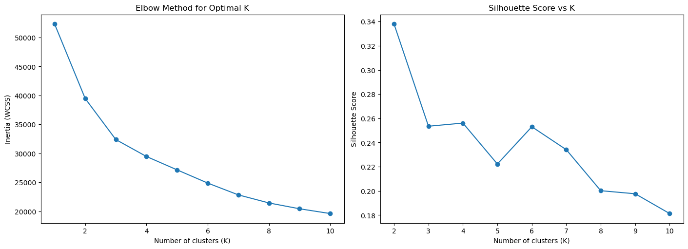
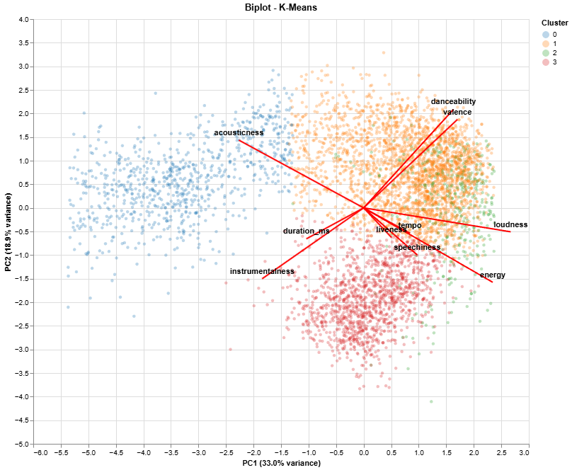
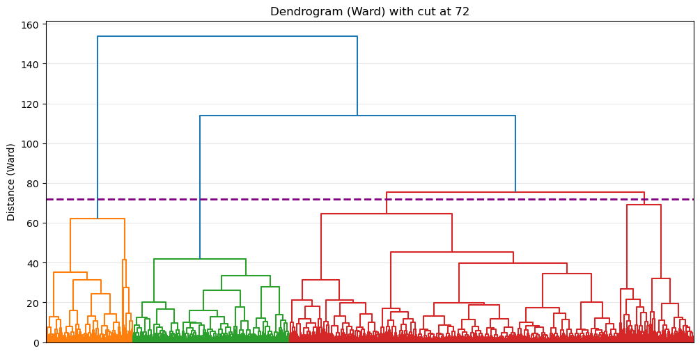
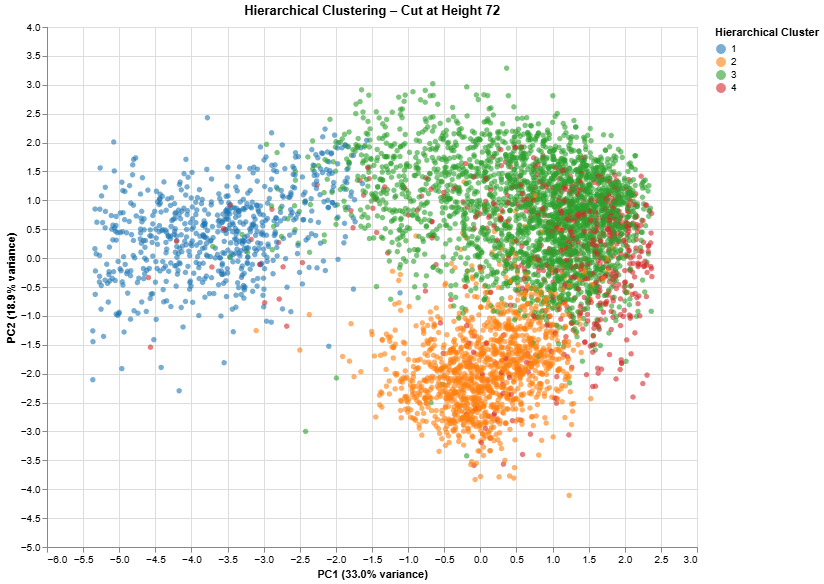

## Global Happiness Ordination: Principal Component Analysis

| Name      | Contribution                         |
|:----------|:-------------------------------------|
|Assad      | Analysis, Report & Spotify Setup |
|Stefan     | Analysis                |
|Zeyad     | Analysis with 3 clusters as a comparison     |
|Shiva      |
|Sumeet     | Analysis and Report              |

---

## Executive Summary

This report analyzes how data-driven methods can support the editorial process of playlist creation. Using Spotify audio features such as energy, valence, and danceability, songs were grouped based on their sonic characteristics rather than traditional genre labels.

K-means clustering identified four distinct musical moods, which were explored and validated using PCA visualizations and hierarchical clustering dendrograms. These clusters were curated into four playlists: **Quiet Hours**, **Feel-Good Grooves**, **Urban Pulse**, and **Heavy After Hours**. Tracks were selected based on how well they represented each cluster, with basic editorial choices such as artist diversity applied.

---

## Dataset Overview

| **Item**                | **Description**                                                                    |
|-------------------------|------------------------------------------------------------------------------------|
| **Dataset Name**        | Spotify 5000 songs                                                           |
| **Number of Rows**      | 5,235                                                                                |
| **Number of Columns**   | 17                                                                                  |
| **File Format**         | `.csv`                                                                             |
| **Source (Name)**       | Github                                                                             |
| **Source Link**         | https://github.com/datagus/ASDA2025/blob/main/datasets/homework_week11/6.3.3_spotify_5000_songs.csv   |
| **Date Accessed**       | 08 Jan 2026                                                                   |

## K Means Clustering

### Justification for Using K-Means Clustering

K-means clustering was selected as the primary unsupervised learning method due to its effectiveness with large datasets composed of continuous numerical features, such as Spotify’s audio attributes. The algorithm groups songs by minimizing within-cluster variance, making it well suited for identifying tracks with similar sonic characteristics.

Because the selected audio features were standardized prior to clustering, distance-based methods like K-means are appropriate and interpretable. In addition, K-means produces explicit cluster centroids, which is particularly valuable for playlist curation, as songs closest to each centroid can be considered strong representatives of a given musical mood. This makes the method both analytically sound and practically useful for editorial applications.

### 1. Feature Selection & Scaling

| Audio Feature | Description |
|--------------|------------|
| Danceability | How suitable a track is for dancing, based on rhythm and tempo |
| Energy | Perceived intensity and activity of a track |
| Loudness | Overall loudness of a track in decibels (dB) |
| Speechiness | Presence of spoken words (higher values indicate rap or talk-heavy tracks) |
| Acousticness | Likelihood that a track is acoustic |
| Instrumentalness | Likelihood that a track contains no vocals |
| Liveness | Presence of a live audience or performance |
| Valence | Musical positivity (higher values sound happier) |
| Tempo | Speed of the track measured in beats per minute (BPM) |
| Duration (ms) | Length of the track in milliseconds |

### 2. Determining number of clusters

### Choice of the Number of Clusters

To determine the optimal number of clusters, both the Elbow Method and Silhouette Analysis were applied. The Elbow plot shows a clear reduction in the rate of decrease of within-cluster sum of squares after four clusters, indicating diminishing returns beyond this point.

Silhouette scores further support this choice, as the solution with four clusters provides a strong balance between cluster cohesion and separation when compared to higher values of K. From an editorial perspective, four clusters also represent a manageable and interpretable number of distinct musical moods. Based on both quantitative metrics and practical interpretability, K = 4 was selected as the final clustering solution.

### 3. Visualization through PCA and Dendrograms 

### PCA Visualization and Interpretation

Principal Component Analysis (PCA) was used to reduce the high-dimensional feature space into two dimensions for visualization purposes. The first two principal components capture a substantial proportion of the total variance, allowing meaningful inspection of the clustering structure.

In the PCA scatter plot, songs belonging to the same K-means cluster tend to group together, while distinct clusters occupy different regions of the plot. This visual separation suggests that the clustering captures genuine structure in the data rather than random variation.

The PCA biplot further illustrates how original audio features contribute to the principal components. Features such as energy, loudness, and tempo load strongly in one direction, while acousticness and instrumentalness load in the opposite direction. This contrast highlights a clear axis separating high-energy, loud tracks from calmer, more acoustic compositions, providing intuitive insight into the nature of the resulting clusters.

### Hierarchical Clustering and Dendrogram Analysis

Hierarchical clustering using Ward’s method was performed as a validation technique. Unlike K-means, hierarchical clustering does not require specifying the number of clusters in advance and instead reveals the nested structure of the data.

The dendrogram shows clear separations between major branches, and when cut at an appropriate height, the resulting number of clusters closely aligns with the four-cluster K-means solution. The consistency between the hierarchical clustering results and the K-means clusters strengthens confidence in the stability and robustness of the identified groupings.

## Results

### Interpretation of Cluster Profiles

The table below reports standardized (z-score) mean values of audio features for each cluster. Positive values indicate that a feature is above the dataset average for that cluster, while negative values indicate below-average values. This representation allows for direct comparison of how each cluster differs in terms of its dominant sonic characteristics.

| Feature | Cluster 0 | Cluster 1 | Cluster 2 | Cluster 3 |
|--------|-----------|-----------|-----------|-----------|
| Danceability | -0.69 | 0.76 | 0.95 | -1.02 |
| Energy | -1.44 | 0.20 | 0.37 | 0.87 |
| Loudness | -1.49 | 0.48 | 0.62 | 0.39 |
| Speechiness | -0.71 | -0.60 | 1.45 | -0.15 |
| Acousticness | 1.46 | -0.25 | -0.40 | -0.81 |
| Instrumentalness | 0.97 | -0.83 | -0.89 | 0.75 |
| Liveness | -1.32 | -0.22 | 0.83 | 0.71 |
| Valence | -0.91 | 0.94 | 0.79 | -0.81 |
| Tempo | -1.49 | 0.33 | 0.66 | 0.50 |
| Duration_ms | 1.38 | -0.82 | -0.65 | 0.08 |

### Quiet Hours

### Cluster Characteristics

The Quiet Hours playlist is characterized by high acousticness and instrumentalness, combined with low energy, loudness, and tempo. Tracks in this cluster tend to be longer in duration and exhibit minimal rhythmic intensity. These features make the playlist well suited for calm, reflective listening environments such as quiet mornings, focused work, or background relaxation.

  

**Playlist Description**: *Soft instrumentals and acoustic sounds for slowing down and clearing your head. Ideal for quiet mornings, focused work, or moments when you just want some calm in the background.* 
**Playlist Link**: [Listen to Quiet Hours on Spotify!](https://open.spotify.com/playlist/46Ql2b9cTdGhhHbzPyGPjN?si=JzH7fujNS5q4_pzwDDgSPg)  
**Sample Songs & Artists**:

| Song                          | Artist          |
|:------------------------------|:----------------|
| Before You Go - Piano Version | Flying Fingers  |
| Saku                          | Susumu Yokota   |
| The Unforgettable             | Dirk Maassen    |
| Violão Vadio                  | Raphael Rabello |
| Young And Foolish             | Bill Evans      |

### Feel-Good Grooves

### Cluster Characteristics

The Feel-Good Grooves playlist is defined by high valence and above-average danceability, indicating a positive and uplifting mood. Energy and tempo values are moderate, creating an accessible and upbeat listening experience without excessive intensity. This cluster captures tracks that feel cheerful, familiar, and emotionally light.

  

**Playlist Description**: *Easygoing, upbeat tracks that lift your mood without trying too hard. Press play when you want something light, positive, and effortlessly feel-good.* 
**Playlist Link**: [Listen to Feel-Good Grooves on Spotify!](https://open.spotify.com/playlist/1FMIxKi50vaIdjXXpCJu5p?si=57RF7OAES3-wyFZ0yEAOIw) 
**Sample Songs & Artists**:

| Song                                      | Artist               |
|:------------------------------------------|:---------------------|
| Guerrera                                  | DELLAFUENTE          |
| I Got You Babe                            | Sonny & Cher         |
| I Guess That's Why They Call It The Blues | Elton John           |
| Lass mich nie mehr los - Studio Version   | Sportfreunde Stiller |
| Waiting For Love                          | Avicii               |

### Urban Pulse

### Cluster Characteristics

The Urban Pulse playlist stands out due to high speechiness, strong rhythmic presence, and elevated danceability. These characteristics are commonly associated with hip-hop, rap, and urban electronic music, where vocal delivery and groove play a central role. The cluster reflects a dynamic, movement-driven sound suitable for city environments and active listening.

  

**Playlist Description**: *Rhythmic, voice-driven tracks with a strong sense of movement and flow. A soundtrack for city nights, long walks, or whenever you want a bit of urban energy.* 
**Playlist Link**: [Listen to Urban Pulse on Spotify!](https://open.spotify.com/playlist/37DZ1WoxhFklk6A4KQmpbA?si=3dkB5VibRoWbC6fjCduupg) 
**Sample Songs & Artists**:

|Song                    | Artist       |
|:-----------------------|:-------------|
| Bring Em Out - Amended | T.I.         |
| Der Himmel soll warten | Sido         |
| Freak                  | R3HAB        |
| Gravel Pit             | Wu-Tang Clan |
| We Fly High            | Jim Jones    |

### Heavy After Hours

### Cluster Characteristics

The Heavy After Hours playlist is marked by high energy, loudness, and tempo, paired with low valence and low acousticness. These features produce a dark, intense, and aggressive sonic profile. The cluster captures music designed for high-volume listening and late-night settings, emphasizing raw power and emotional intensity.

  

**Playlist Description**: *Dark, loud, and intense tracks made for late nights and turned-up volumes. Perfect when you want something heavy, raw, and unapologetic.* 
**Playlist Link**: [Listen to Heavy After Hours on Spotify!](https://open.spotify.com/playlist/04QIYwQGxI3pIbIHyVUofg?si=eorewadPRgySlCmpHYzlcQ) 
**Sample Songs & Artists**:

| Song                   | Artist      |
|:------------------------|:------------|
| Forsaken                | Entombed    |
| Frozen Soul             | Asphyx      |
| Ridden with Disease     | Autopsy     |
| The Secrecies of Horror | Pestilence  |
| Without Sin             | Morta Skuld |

### Comparative Summary of Playlist Characteristics

Overall, the four playlists differ clearly in terms of intensity, emotional tone, and sonic texture. Quiet Hours represents the calmest profile, characterized by low energy, low loudness, and high acousticness, while Heavy After Hours lies at the opposite extreme with high energy, loudness, and tempo, producing a dark and intense sound. Feel-Good Grooves and Urban Pulse occupy intermediate positions but differ in key ways: Feel-Good Grooves emphasizes high valence and accessibility, creating a positive and uplifting mood, whereas Urban Pulse is distinguished by stronger rhythmic emphasis and higher speechiness, reflecting a more vocal-driven and movement-oriented style. These contrasts confirm that the clusters capture distinct musical moods rather than overlapping categories, supporting their translation into clearly differentiated playlists.

## AI Disclaimer
- Use of Visual Studio / PyCharm with Github copilot (inline code suggestions) 
- AI was used to compile playlist images
 
