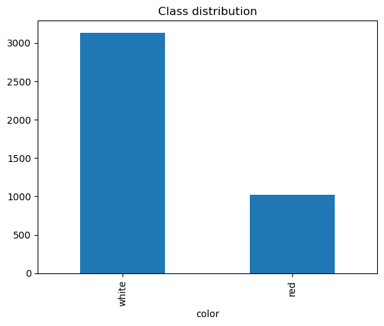
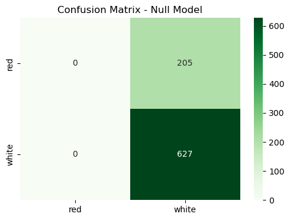
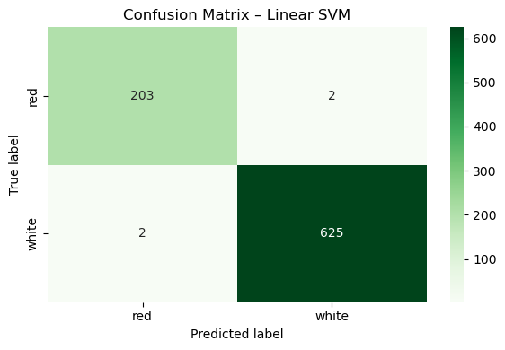
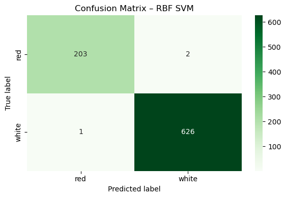
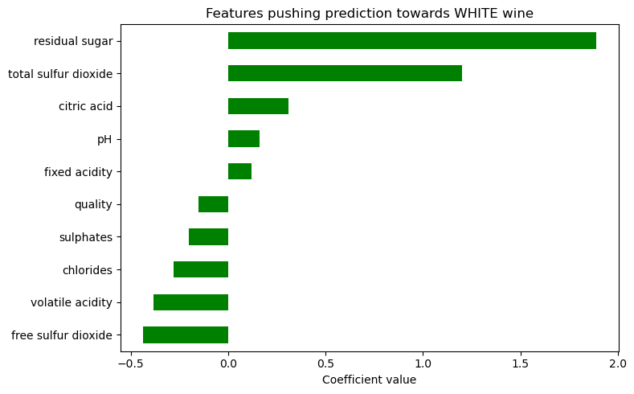
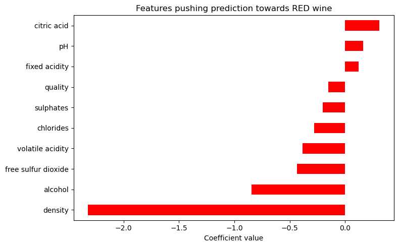
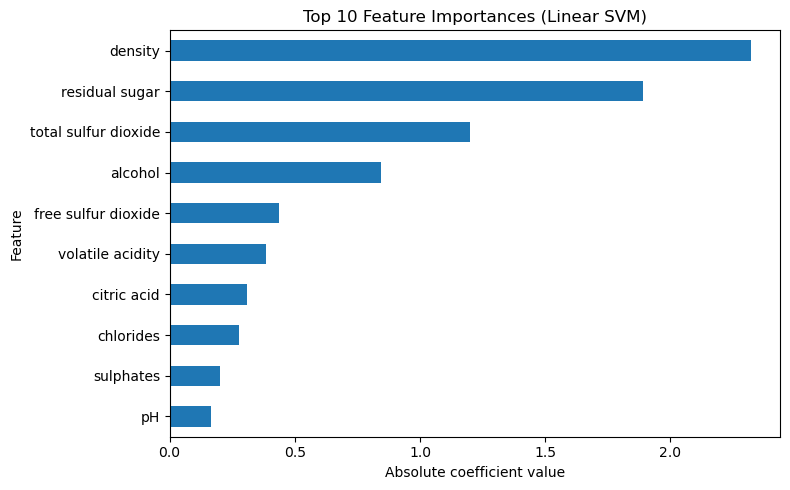
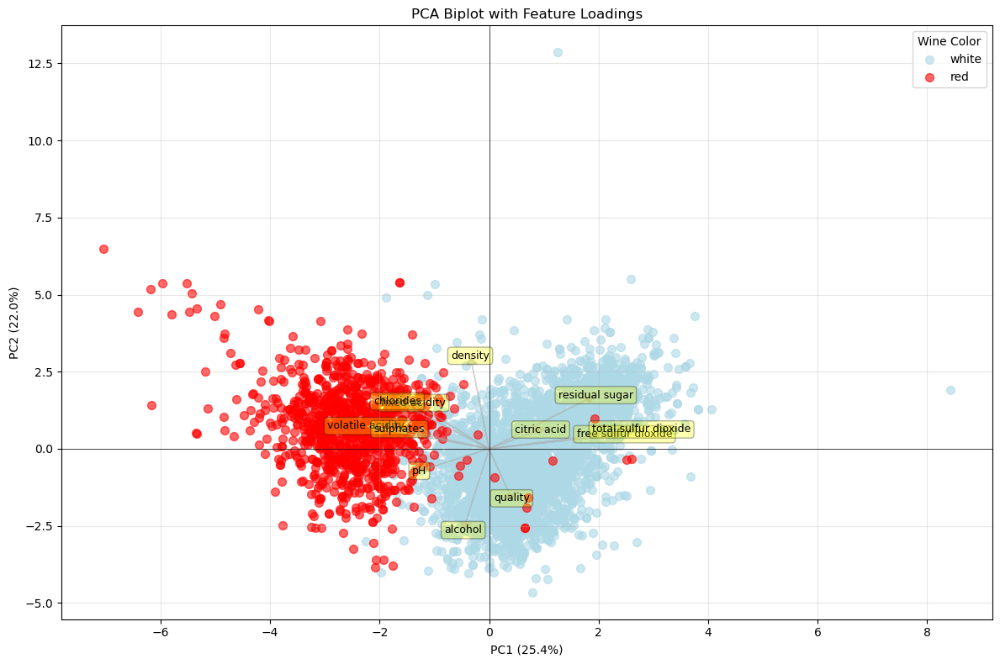
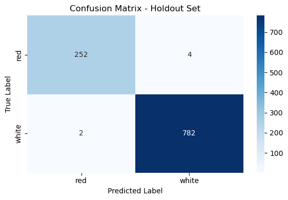

## Wine Color Classification using Support Vector Machines

| Name      | Contribution                         |
|:----------|:-------------------------------------|
|Assad      | SVM Implementation and Analysis   |
|Stefan     | SVM Implementation and Analysis, Report |
|Zeyad     |  -    |
|Shiva      | -
|Sumeet     |   -            |

---

## Executive Summary

This report documents the application of Support Vector Machines (SVM) for wine color classification, comparing linear and RBF kernels to build a robust predictive model. The analysis includes comprehensive data preparation with stratified splitting to preserve class proportions, parameter tuning through cross-validation, and evaluation on holdout data to assess generalization performance. The final linear SVM model achieved strong performance on both training and holdout data, demonstrating the effectiveness of SVM for this binary classification task.

---

## Dataset Overview

| **Item**                | **Description**                                                                    |
|-------------------------|------------------------------------------------------------------------------------|
| **Dataset Name**        | Wine Quality Dataset                                                               |
| **Number of Rows**      | 4,157 wines (development set)                                                      |
| **Number of Columns**   | 14                               |
| **File Format**         | `.csv`                                                                             |
| **Source (Name)**       | Github                                                                             |
| **Source Link**         | https://github.com/StefanFSmid/ASDA_2025_Group_3_Porfolio                          |
| **Date Accessed**       | 19 January 2026                                                                   |

---

## Dataset Structure

| Feature/Variable        | Data Type | Description                                              | Non-Null Count | Example Values       |
|:------------------------|:----------|:---------------------------------------------------------|---------------:|:---------------------|
| fixed acidity           | float64   | Tartaric acid concentration (g/dm³)                      |          4,157 | 4.6, 7.2, 9.8        |
| volatile acidity        | float64   | Acetic acid concentration (g/dm³)                        |          4,157 | 0.27, 0.65, 1.08     |
| citric acid             | float64   | Citric acid concentration (g/dm³)                        |          4,157 | 0.0, 0.34, 0.92      |
| residual sugar          | float64   | Residual sugar after fermentation (g/dm³)               |          4,157 | 0.9, 2.5, 15.4       |
| chlorides               | float64   | Sodium chloride concentration (g/dm³)                   |          4,157 | 0.029, 0.076, 0.611  |
| free sulfur dioxide     | float64   | Free SO₂ concentration (mg/dm³)                         |          4,157 | 3, 17, 72            |
| total sulfur dioxide    | float64   | Total SO₂ concentration (mg/dm³)                        |          4,157 | 6, 45, 289           |
| density                 | float64   | Wine density (g/cm³)                                     |          4,157 | 0.9901, 0.9956, 1.001|
| pH                      | float64   | Acidity level (pH scale 0-14)                           |          4,157 | 2.74, 3.31, 4.01     |
| sulphates               | float64   | Potassium sulphate concentration (g/dm³)                |          4,157 | 0.33, 0.62, 2.0      |
| alcohol                 | float64   | Alcohol content (% by volume)                           |          4,157 | 8.4, 10.5, 14.9      |
| quality                 | int64     | Quality rating (score from 0-10)                        |          4,157 | 3, 6, 9              |
| **color** *(target)*    | object    | Wine color classification (red or white)                |          4,157 | red, white           |
| wine_id                 | int64     | Unique identifier for each wine sample                  |          4,157 | 1, 2048, 4157        |

---

## Data Preparation and Exploration

### 1. Class Balance and Data Integrity

The wine color dataset contains two classes: red and white wines. Prior to model development, careful examination of class distribution was conducted to understand potential imbalance issues. The stratified train-test split ensured that both training and test sets maintained the same class proportions as the original dataset, preventing bias towards the majority class.

All features were checked for missing values, and no null values were detected across the 11 pysicochemical features. This clean data structure allowed for straightforward preprocessing without additional imputation steps.

### 2. Feature Scaling

Feature scaling was performed after data splitting to avoid data leakage—a critical step in machine learning workflows. The StandardScaler was fit exclusively on the training set and subsequently applied to both training and test sets, ensuring that no information from the test set influenced the scaler's parameters. This approach maintains the integrity of the model evaluation.

All 12 features were standardized to have mean 0 and standard deviation 1, ensuring that distance-based algorithms like SVM are not biased towards features with larger scales.

### 3. Data Splitting Strategy

The dataset was split into training and test sets using a 80-20 stratified split (random_state=42):
- **Training set:** Used for model training and cross-validation
- **Test set:** Used for internal model evaluation
- **Holdout set:** Separate dataset for final generalization assessment (last step)

| Color | Train | Test |
|:------|------:|-----:|
| white | 2,507 |  627 |
| red   |   818 |  205 |
| **Total** | **3,325** | **832** |

---

## Support Vector Machines for Classification
### 1. Model Configuration and Parameter Tuning

Two SVM variants were trained and compared:

**Linear SVM:**
- **Kernel:** Linear
- **Regularization parameter (C):** Tuned via grid search across [0.001, 0.01, 0.1, 1, 10, 100, 1000]
- **Best C value:** Determined through cross-validation

**RBF SVM:**
- **Kernel:** Radial Basis Function (RBF)
- **Regularization parameter (C):** [0.1, 1, 10, 100, 1000]
- **Gamma:** ["scale", "auto", 0.001, 0.01, 0.1, 1]
- **Best parameters:** Selected based on cross-validation F1-score

### 2. Cross-Validation and Model Selection

Five-fold stratified cross-validation was employed with the macro-averaged F1-score as the evaluation metric. This metric is particularly appropriate for classification tasks, as it balances precision and recall while providing equal weight to both classes, mitigating the impact of class imbalance.

The grid search systematically evaluated different regularization parameters for both kernel types, comparing their performance on the holdout validation folds. This approach ensures robust parameter selection independent of any single train-test split.

---

## Model Performance and Comparison

### Dummy Classifier (Baseline)

**Confusion Matrix:**

**Metrics:**

|              |   precision |   recall |   f1-score |   support |
|:-------------|------------:|---------:|-----------:|----------:|
| red          |        0    |     0    |       0    |    205    |
| white        |        0.75 |     1    |       0.86 |    627    |
| accuracy     |        0.75 |     0.75 |       0.75 |      0.75 |
| macro avg    |        0.38 |     0.5  |       0.43 |    832    |
| weighted avg |        0.57 |     0.75 |       0.65 |    832    |

---

### Linear SVM

**Confusion Matrix:**

**Metrics:**

|              |   precision |   recall |   f1-score |   support |
|:-------------|------------:|---------:|-----------:|----------:|
| red          |        0.99 |     0.99 |       0.99 |       205 |
| white        |        1    |     1    |       1    |       627 |
| accuracy     |        1    |     1    |       1    |         1 |
| macro avg    |        0.99 |     0.99 |       0.99 |       832 |
| weighted avg |        1    |     1    |       1    |       832 |

---

### RBF SVM

**Confusion Matrix:**

**Metrics:**

|              |   precision |   recall |   f1-score |   support |
|:-------------|------------:|---------:|-----------:|----------:|
| red          |           1 |     0.99 |       0.99 |       205 |
| white        |           1 |     1    |       1    |       627 |
| accuracy     |           1 |     1    |       1    |         1 |
| macro avg    |           1 |     0.99 |       1    |       832 |
| weighted avg |           1 |     1    |       1    |       832 |

## Model Selection

The linear SVM was selected as the final model despite comparable performance with RBF SVM. Both variants achieved near-perfect accuracy (1.0) on test data, but linear SVM offers superior interpretability and lower computational complexity.

---

## Feature Importance and PCA Biplot of the Final Model

### Feature Importance

The linear SVM model's coefficients were analyzed to determine the importance of each feature in classifying wine color. Features with positive coefficients indicate a tendency towards predicting white wine:

Features with negative coefficients suggest a bias towards red wine:

The magnitude of these coefficients reflects the strength of each feature's influence on the classification decision. The top features identified include:

### PCA Biplot

To visualize the separation of wine classes in the feature space, Principal Component Analysis (PCA) was applied, reducing the dimensionality to two principal components. The resulting biplot illustrates:

- **Data Points:** Colored by wine color, showing the distribution of red and white wines.
- **Feature Loadings:** Arrows indicating the contribution of each feature to the principal components.

This visualization highlights the distinct clustering of wine classes, suggesting that the linear SVM effectively captures the underlying patterns in the data. The biplot confirms the model's ability to differentiate between red and white wines based on their physicochemical properties.

---

### Holdout Set Validation
The holdout set serves as a true test of generalization on completely unseen data, independent of any tuning processes. The model maintains exceptional performance with 0.99 accuracy and 0.99 macro F1-score, closely mirroring the test set results. This consistency between test and holdout validation demonstrates robust generalization without evidence of overfitting, confirming that the linear SVM has learned generalizable patterns rather than memorizing training data.

**Confusion Matrix:**

**Metrics:**

|              |   precision |   recall |   f1-score |   support |
|:-------------|------------:|---------:|-----------:|----------:|
| red          |        0.99 |     0.98 |       0.99 |    256    |
| white        |        0.99 |     1    |       1    |    784    |
| accuracy     |        0.99 |     0.99 |       0.99 |      0.99 |
| macro avg    |        0.99 |     0.99 |       0.99 |   1040    |
| weighted avg |        0.99 |     0.99 |       0.99 |   1040    |

---

## Key Findings

The analysis reveals that both SVM variants substantially outperformed the baseline dummy classifier, which achieved only 75.4% accuracy and 0.429 macro F1-score by predicting exclusively the majority class. The linear SVM emerged as the superior model, demonstrating strong generalization with consistent performance between test and holdout validation sets, indicating no significant overfitting. Compared to the dummy classifier's inability to identify red wines (0.000 recall), the linear SVM achieved balanced performance across both wine classes through its learned decision boundary, resulting in comparable macro F1-scores for red and white wine predictions. The RBF SVM, while offering additional modeling flexibility through kernel transformation, did not provide performance gains sufficient to justify its added complexity. The linear kernel's effectiveness suggests that red and white wines are largely linearly separable in the feature space. 

---

## AI Disclaimer
- Use of Visual Studio / PyCharm with Github copilot (inline code suggestions & agent) for coding, visualizating, and formulating

 